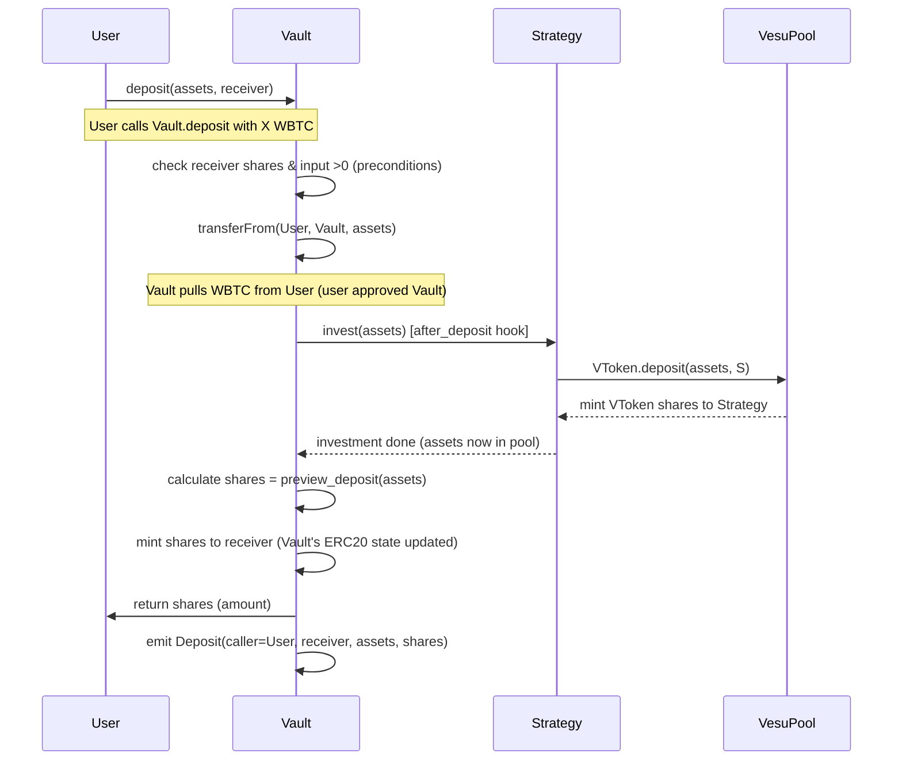
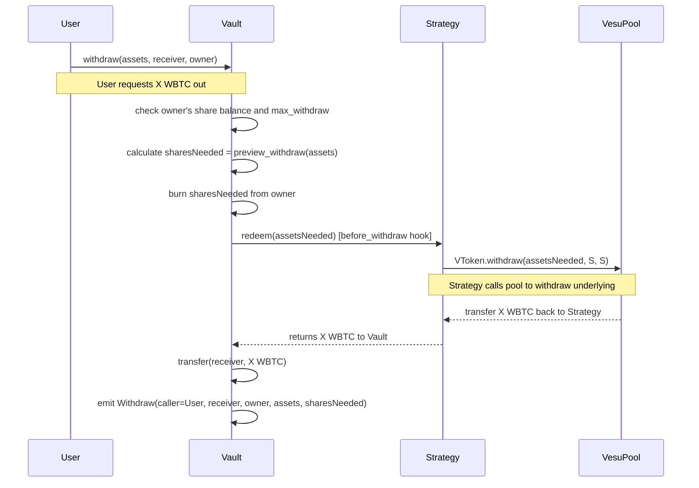
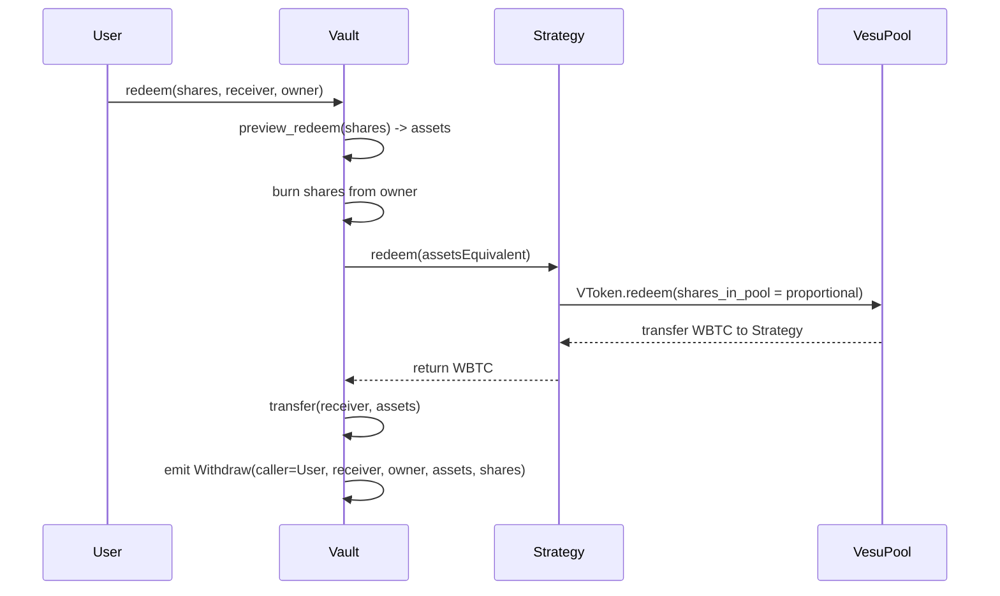
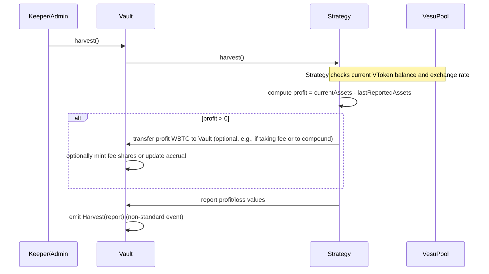
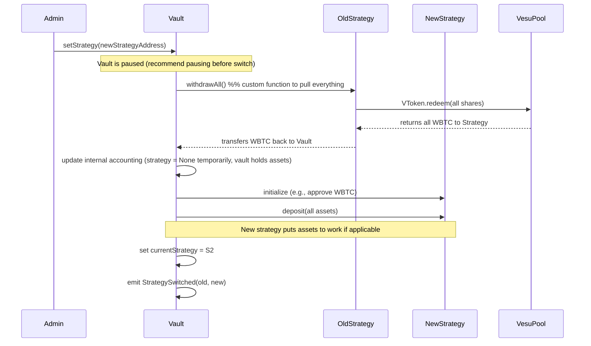

# Goals and Non-Goals
Our primary goal is to implement a secure, modular ERC‑4626 vault on Starknet for BTC assets, providing real yield via a lending strategy. The vault will accept Starknet-wrapped BTC (we choose Wrapped Bitcoin (WBTC) as the underlying asset, being the most widely adopted BTC wrapper on Starknet). It will conform to the OpenZeppelin (OZ) ERC‑4626 standard for Starknet, ensuring compatibility with DeFi aggregators and interfaces. The design emphasizes safety and correctness (protecting user funds, preventing dilution attacks, handling rounding) over chasing maximum APY. It will be modular, allowing the yield strategy to be swapped out via a clean interface without changing the vault. Simplicity is key: yield is obtained by lending the BTC asset on a Starknet lending market (we integrate with Vesu V2, a Starknet lending protocol) in a straightforward supply-only strategy. Push-based yield harvesting (triggered on user actions or explicit calls) is acceptable, avoiding complex automation. Non-goals: In this v0, we do not implement cross-chain bridges or native BTC interoperability (no bridging to Bitcoin mainnet or L1 contracts) – those are future extensions. We also avoid multi-strategy allocation or complex yield farming; only a single simple strategy is used initially (though the architecture permits adding more complex strategies later). The vault will not simulate fake yield; it relies on real protocol interest. We will not introduce untested optimizations that compromise clarity (e.g., no highly leveraged strategies). Upgradeability is minimized to reduce complexity and trust assumptions (see below). The initial version does not include fee extraction (fees can be zero by default, though extensible later).

## Contract Decomposition
Vault (ERC-4626 Vault) – The core contract implementing the ERC-4626 interface on Starknet. It inherits from OZ's Cairo ERC4626 component, meaning it is also an ERC-20 token representing vault shares. Users deposit WBTC and receive shares; shares can be redeemed for WBTC. The Vault is responsible for accounting (tracking total assets, share supply) and enforcing ERC-4626 conversion rules (deposit/mint, withdraw/redeem, previews, etc.). It holds minimal asset balance, usually forwarding deposits to the strategy. Key roles in Vault: users (regular depositors/withdrawers), a privileged Vault Admin (for pausing, strategy changes, emergency withdrawal), and possibly a Yield Harvester role if we restrict harvest calls (could be the admin or a keeper bot). Strategy Interface (IStrategy) – An abstract interface defining interactions between the Vault and any yield-generating strategy. This ensures the vault can work with different strategies interchangeably. The interface includes functions like deposit(uint256 assets), withdraw(uint256 assets) (to pull out underlying), totalAssets() -> uint256 (how much underlying the strategy currently holds), harvest() -> (uint256 profit, uint256 loss) (to realize any yield or loss and return it to vault), and shutdown() or emergencyWithdraw() for emergency asset recovery. The strategy interface also defines an asset() -> address to ensure strategy's underlying matches the vault's asset (for safety checks). All interactions are done by the Vault calling the strategy. Concrete Strategy v0 (LendingStrategyV0) – The initial strategy implementation, focused on supplying WBTC to Vesu's lending pool for yield. Vesu V2 segregates each asset into its own pool and uses an ERC-4626 compliant "VToken" vault as the deposit receipt. Our strategy will deposit WBTC into Vesu’s WBTC pool by calling the VToken’s deposit function. In return, the strategy contract will hold VToken shares representing the lent WBTC plus accrued interest (yield accrues as the exchange rate of VToken increases). On withdraw, the strategy will redeem VToken shares back for underlying WBTC. The strategy encapsulates all Vesu-specific logic: e.g., approving WBTC for the VToken contract, tracking any reward tokens (though initial scope: just interest in WBTC). The strategy will be upgradeable (swap-out) in the sense that the Vault can be pointed to a new strategy contract via an admin function setStrategy(), facilitating future strategy upgrades or changes without altering the Vault code. Aside from the Vault, no other contract should be authorized to pull from the strategy. Access Control / Aux Contracts – We incorporate OpenZeppelin’s Access Control for role management (e.g., roles for admin, pauser, strategist). The Vault might directly embed role-based access: e.g., only Admin can call setStrategy, pause, or unpause (if we include a Pausable module for emergency stops). If fees or performance incentive were planned, a separate FeeController module or logic could be included (though in v0 we use OZ’s no-fee default ). We also include Guard logic: e.g., a Reentrancy guard to prevent reentrant calls if needed (Starknet’s call model is different, but we should still guard state-changing functions), and Pausable toggles to halt operations during emergencies. No separate “Fees module” contract exists in v0 since fees are zero; if enabling fees later, we’d implement OZ’s FeeConfigTrait within the vault to skim fees on deposit/withdraw as needed . External Protocol Integration Points – The vault system integrates with one external protocol: Vesu’s WBTC lending pool. Specifically, integration occurs in the strategy: Vesu VToken contract (for WBTC) — via its ERC-4626 interface. Key entry points: deposit(amount, to) to supply WBTC and receive VTokens, redeem(shares, to, from) or withdraw(amount, to, from) to retrieve WBTC. The strategy will likely use deposit and redeem (since the strategy itself will hold the VTokens as from). The strategy must also handle token approvals: before depositing WBTC into Vesu’s vault, the strategy must call the WBTC token’s approve(VToken_address, amount) allowing Vesu to pull the WBTC . Vesu’s VToken is itself an ERC-4626 vault, so deposit returns shares (VTokens) minted; our strategy will hold those. The yield realization happens implicitly: as interest accrues in Vesu, each VToken share can be redeemed for more WBTC over time. So our vault’s yield is realized when we compare the WBTC amount we can withdraw now vs. earlier. If Vesu distributes any incentive rewards (e.g. STRK tokens per their BTCFi program ), those are out-of-scope for v0 (nonetheless, strategy is written flexibly to handle extra tokens if needed in future). No other external protocols are directly used in v0. (Swapping between different BTC wrappers is not built-in; if a user holds a different BTC token, they must swap to WBTC externally for now. In future, we could integrate a swap if needed, but that is documented as future work.) Upgradeability Stance – We choose no proxy upgrade for the Vault contract itself, opting for simplicity and security. The vault is a simple contract that will be deployed immutably. This avoids the complexity and risk of proxy upgrade patterns on Starknet (which require careful storage handling ). If a severe issue or new version is needed, we plan to deploy a new vault contract and migrate funds via a controlled process (users could withdraw from old and deposit to new, or an upgrade tool could assist). This approach is in line with prioritizing trustlessness: users don’t have to trust an admin not to arbitrarily change vault logic. The Strategy, however, is designed to be swappable via the vault’s setStrategy (only callable by Admin). This provides a controlled form of upgrade for the yield source: e.g., switching to a new Strategy contract (perhaps for a different protocol or improved logic) by first withdrawing all funds from the old strategy and then moving them to the new one. This strategy replacement is an explicit, one-time operation and not a continuous proxy upgrade – it requires the Admin to execute a migration procedure, which we will tightly define and test. In summary: Vault is non-upgradeable (immutable code), Strategy is upgradeable by replacement (with Admin control and proper migration), which balances safety with flexibility. Security Model and Trust Assumptions – The design assumes the underlying token (WBTC) and external protocol (Vesu) function as specified (WBTC is a standard ERC-20, Vesu’s pool maintains solvency). The main trust is in the Vault Admin: this role can pause the system and change the strategy. Administrators must be trusted not to abuse these powers. However, Admin cannot directly withdraw user funds (except via the emergency path that still only sends to users or to vault). We expect the Admin to possibly be a multisig or governance contract in a production setting. The Vault holds user shares and small amounts of WBTC (most WBTC goes to strategy). The Strategy holds the bulk of assets (as Vesu VTokens or possibly as underlying during transitions). Thus, a compromise of the Strategy contract or a malicious strategy could mismanage funds – we mitigate this by keeping the strategy simple, thoroughly audited, and limiting its privileges (the Vault addresses the strategy directly, users do not). If the strategy misbehaves or the external protocol fails (e.g., a lending pool hack or insolvency), the vault provides an emergency withdraw mechanism for Admin to pull whatever assets remain from the strategy back to the Vault for users to withdraw. We also implement pausing: if a severe bug is detected or an attack suspected, Admin can pause deposits/withdrawals to halt state changes while a response is planned. Failure modes: We analyze potential failures and how they’re handled:

*   **External yield failure:** e.g., Vesu loses some WBTC due to bad debt. This would reflect as the strategy’s totalAssets() being less than expected. Our vault logic naturally propagates that loss to all share owners pro-rata (share price goes down). Nobody can gain more than their share, and withdraws will return less underlying (but still fair by share). We treat this as an investment loss scenario; no user-specific insolvency since vault is not leveraged. The vault’s invariants (totalAssets equals asset in strategy plus in vault) still hold, just lower value.
*   **External call failure:** If Vesu’s deposit or redeem call reverts (e.g. due to paused market), our strategy will bubble up the error and vault operations revert – users cannot deposit/withdraw until resolved. In an emergency, Admin can call a special strategy function to attempt a force withdraw of assets or call a different function if provided by Vesu (or as last resort mark the strategy as insolvent and stop).
*   **Rounding and edge cases:** The vault uses OZ’s ERC4626 math which by spec rounds favorably to the Vault on deposit (round down shares) and favorably to the Vault on withdraw (round up shares burned) . This can cause tiny slippage in user received amounts which accumulates in the vault (benefiting remaining holders). We mitigate abuse of this via the standard inflation attack defense (see below) and by discouraging tiny dust deposits.
*   **Inflation attack (donation attack):** As documented by OZ , if an attacker can inject assets into the vault without receiving shares (via direct token transfer to contract), they could skew the share price to steal value from the next depositor. Our implementation prevents this in two ways: (1) Using the OZ component’s virtual share/asset offset mechanism . The vault will maintain an internal “virtual balance” (initializing with a tiny amount of virtual shares and assets, e.g. 1e-~~ decimals offset) to enforce a minimum exchange rate even when empty, making pure donations less effective. This uses higher precision for shares than the asset (decimals expansion) and ensures the first real deposit isn’t essentially worthless . (2) By design, our vault keeps almost no idle WBTC (pushing to strategy), so a direct token donation to the vault contract would be unusual – even if it happens, those tokens sit idle and are still counted in totalAssets, so the share price would spike making the attacker’s share (if they had any) more valuable only proportionally; but with the virtual offset, an attacker would lose a portion of any donation to existing (or virtual) shareholders , making the attack unprofitable. We will document and test this scenario thoroughly.
*   **Reentrancy:** Starknet’s call architecture doesn’t allow a user to directly reenter the same transaction like in EVM (no fallback function to exploit), but since our vault and strategy might call external contracts (e.g., Vesu), we add guards to prevent any unintended reentrant calls. Specifically, we mark deposit/withdraw functions as non-reentrant (using a reentrancy lock) to avoid strange callback issues if the external protocol were to call back into our vault (unlikely with Vesu, but a general safety).
*   **Arithmetic overflow/underflow:** We use Cairo’s u256 type for amounts, which safely handles 256-bit math. Conversions between shares and assets are done via formulas that could involve multiplication and division; using OZ’s implementation means those have built-in safe math and careful handling of rounding . We must carefully test extreme values (max supply, 0 values) to ensure no overflow (the use of 256-bit and standard library mitigates this).
*   **Misuse of Admin privileges:** The Admin could theoretically set a malicious strategy contract. This is a central trust concern – we assume the admin is governed or highly trusted. As mitigation, if governance is decentralized, changes of strategy could have timelocks or multi-signature approvals outside of the contract. The vault will emit an event whenever the strategy changes, and we mandate in documentation that the new strategy contract should be audited and ideally initially empty of funds (we will migrate funds through vault’s logic). Admin can also pause or trigger emergency withdrawal; these actions, if misused (e.g., pausing indefinitely), could inconvenience users but not directly steal funds (emergencyWithdraw only sends funds back to vault and allows users to redeem, it doesn’t send to admin).

The system's design leans heavily on well-audited OZ components and standard patterns to minimize novel attack surface. The attached Roles & Permissions matrix details which roles can call which sensitive functions, and the expected trust for each:

| Role | Permissions/Actions | Purpose | Trust Assumptions |
| :--- | :--- | :--- | :--- |
| User | deposit, mint, withdraw, redeem (their own) | Regular vault interactions (ERC4626 interface) | Assumed honest, may try to game rounding (negligible impact) |
| Vault Admin | setStrategy, pause/unpause, emergencyWithdraw, harvest (if manual), set fees (if enabled) | Manage vault configuration and respond to emergencies | Must be trusted not to rug funds; ideally multi-sig or governed. Cannot directly withdraw user funds except to return to users. |
| Strategy (contract) | (no external calls; called by Vault) | Holds assets, interacts with external protocol | Assumed honest code; has access to all vault assets in strategy. Audited and upgradeable only by Admin. |
| Keeper (optional) | harvest/poke functions (if not done by users) | Trigger regular yield harvests or upkeep | Minor trust – if incentivized, should not be able to steal funds, only calls public harvest. Could be open to anyone if harvest is non-sensitive. |
| Attacker (external) | – (no direct permissions) | Could attempt reentrancy, donation, price manipulation | Mitigations in place (reentrancy guard, donation offset, pause on anomalies). |

## Diagrams

### Component Diagram
Below is a high-level component diagram in ASCII, showing the relationships between the Vault, Strategy, the external Lending Pool (Vesu), and key roles:

```text
 [ User ]
    │   (ERC-4626 interface: deposit/withdraw)
    v
 [ Vault (ERC-4626) ] 
    │    shares minted/burned
    │    calls via IStrategy
    v
 [ Strategy V0 (LendingStrategy) ] 
    │    holds WBTC or VTokens
    │    calls external protocol
    v
 [ Vesu Lending Pool ] (external)
    │   (Vesu VToken vault for WBTC)
    └──> yields interest over time
    
 Admin (role):
   - can set new [Strategy]
   - can pause Vault
   - can trigger emergency withdraw (Strategy -> Vault)
```

### Sequence Diagram – Deposit
This diagram shows the flow when a user deposits WBTC into the vault (happy path):



Key points in deposit flow: Vault uses transfer_from to get tokens , then calls Strategy. In our design, this happens inside an after_deposit hook of the OZ ERC4626 component, ensuring the deposit accounted shares are minted before or atomically with sending to strategy. The share amount is determined by preview_deposit which must equal the actual minted shares (OZ spec ensures that). The external call to Vesu’s pool transfers the WBTC out of our contracts, and the Vault ends holding only the newly minted vault shares (to user) and perhaps a dust of WBTC if any rounding. The Deposit event contains the exchange rate info pre/post fees if any (here no fees, so it’s straightforward). ### Sequence Diagram – Withdraw User withdraws a certain amount of WBTC (assets) from the vault, specifying a receiver and the owner of shares:



On withdraw, the Vault first calculates how many shares need to be burned to give the requested asset amount. According to ERC-4626, preview_withdraw(assets) already accounts for any fee that needs to be added on top in shares (but we have no fee, so sharesNeeded = assets * (totalSupply/totalAssets) rounding up). The Vault burns that many shares from the owner's balance, then calls the Strategy to retrieve the required assets in a before_withdraw hook (so that assets will be available for transfer out). The Strategy interacts with Vesu's pool: using withdraw or redeem to get underlying WBTC. When Strategy returns, Vault transfers the WBTC to the specified receiver address. The Withdraw event is emitted, including the shares burned (which may include any fee portion if fees were taken). Note that both Deposit and Withdraw events effectively allow external observers to compute the vault's exchange rate at those moments (they show assets vs shares).

### Sequence Diagram – Redeem (similar to withdraw, but user specifies shares to redeem for assets):



Redeem is essentially the mirror of deposit’s “mint” function path. It burns exactly the shares specified and returns whatever asset that amount of shares is worth (again, any rounding favors the vault: the user might get a tiny bit less than shares * price if not perfectly divisible). Both withdraw and redeem emit the Withdraw event in ERC-4626 (the spec uses the same event for both) . ### Sequence Diagram – Harvest (Yield Collection) In our simple lending strategy, harvest might not need to actively do much, because interest is automatically accrued in the Vesu pool (the value of VToken increases). However, we define a harvest() function to handle any periodic actions (like claiming rewards or updating book-keeping). For our vault, harvest can be a no-op or just an event emission for tracking. But imagine if Vesu distributed STRK tokens as rewards, then harvest would collect them and perhaps convert to WBTC. We keep it simpler:



Since this vault auto-compounds by virtue of shares price, we might not actually need to transfer profit out of strategy – keeping it invested yields compound interest. So, harvest could simply update internal accounting (perhaps storing the last known totalAssets for strategy) and emit an event with profit/loss since last harvest. If there’s a performance fee, it would be taken here: e.g., if profit, mint some vault shares to a fee recipient as performance fee (this would dilute slightly the profit to users, capturing value). In v0, we have no fees, so harvest is mostly informational. The call can be open to anyone (since there’s no sensitive action), or restricted to a role if desired. Notably, if losses have happened (say some borrower default and WBTC lost), harvest should record it so that future accounting knows the vault’s totalAssets dropped (the vault’s own totalAssets() will already reflect it via strategy’s report). The Harvest event (if we include it) is not part of ERC-4626 spec, but a common extension in Yearn-like vaults for transparency; on Starknet we’d implement it as a custom event. ### Sequence Diagram – setStrategy (Strategy Switching) When switching strategies, we must safely migrate assets:



We assume the Admin will have paused deposits and perhaps withdrawals during the switch to avoid inconsistent states. The Vault calls the old strategy to withdraw everything (perhaps using an emergencyWithdraw or withdrawAll function that ignores normal withdraw limits). The Vault receives all WBTC from old strategy, then calls the new strategy’s deposit to move the funds in. Finally it updates an internal pointer to mark the new strategy as active. If anything fails (e.g., new strategy deposit reverts), the Admin can either retry or in worst case leave funds in vault and mark no strategy active until resolved (users could then withdraw directly from vault if needed). During normal operation, vault’s totalAssets() = assets held in strategy + assets in vault. Right after migration, for a short time, assets will be in vault, then moved to new strategy. We will test that no shares are affected by strategy switch; share value continuity should hold (aside from perhaps minor differences if strategies had different rounding behaviors). ### Sequence Diagram – Emergency Withdraw (Paused) In an emergency (like strategy or external protocol failure), Admin triggers an emergency withdrawal of all assets to vault and halts operations:

```mermaid
sequenceDiagram
    participant A as Admin
    participant V as Vault
    participant S as Strategy
    participant P as VesuPool
    A->>V: pause()
    A->>V: emergencyWithdraw()
    V->>S: emergencyWithdraw()
    alt S can withdraw normally
       S->>P: VToken.redeem(all shares)
       P-->>S: sends WBTC back
       S-->>V: transfers all WBTC to Vault
    else S is unresponsive
       S-->>V: (no response or partial)
       Note over V,S: Strategy might be stuck; Admin may have to take further action (not automated in contract).
    end
    V->>V: emit EmergencyWithdraw(totalRecovered)
    Note over V: Vault now holds whatever WBTC was recovered;
    Note over V: (Users can withdraw their pro-rata assets from Vault directly)
```

If the strategy’s external call partially fails (say only some funds recoverable), the vault will still record whatever came back. Users can then use withdraw or redeem from the vault – since the vault’s totalAssets now reflects only what’s left, each share gets its proportional piece of what was recovered. Losses are socialized automatically. After this, presumably the vault would remain paused and probably not resume (or could allow only withdrawals, no new deposits). In code, we might allow emergencyWithdraw to unpause withdrawals for users but block deposits permanently unless a new strategy is set. ### Class Diagram / Storage Layout Below is an overview of the main storage variables and struct relationships (in pseudo-class form):

Vault (ERC4626, ERC20) \[storage]
├─ asset: ContractAddress                // WBTC token address
├─ totalAssets(): computed (delegated to strategy or balance)
├─ currentStrategy: ContractAddress (IStrategy) 
├─ feeConfig: FeeConfigTrait             // (using ERC4626DefaultNoFees in v0)
├─ paused: bool                          // for circuit breaker
└─ (ERC20 state: name, symbol, decimals, totalSupply, balances, allowances...)

IStrategy (interface)
├─ asset() -> ContractAddress            // should match Vault.asset()
├─ totalAssets() -> uint256              // how much underlying held
├─ deposit(uint256 assets) -> uint256    // sends assets to work, returns amount invested (maybe same as input or shares)
├─ withdraw(uint256 assets) -> uint256   // pulls out underlying, returns actually withdrawn (maybe same as input)
├─ withdrawAll() -> uint256              // pull everything (for migration)
├─ harvest() -> (uint256 profit, uint256 loss)
└─ emergencyWithdraw() -> uint256        // force pull everything if possible

LendingStrategyV0 (implements IStrategy) \[storage]
├─ asset: ContractAddress (WBTC)
├─ vToken: ContractAddress (Vesu ERC4626 vault for WBTC)
├─ vault: ContractAddress (backpointer to Vault)
├─ lastReportedAssets: uint256 (for profit calc)
└─ (possibly reward token addresses, etc, not used in v0)

We rely on OpenZeppelin’s implementation for much of Vault’s internals, which uses a component-based storage. For example, OZ’s ERC20Component storage covers name, symbol, balance mapping, etc . OZ’s ERC4626Component likely doesn’t add new storage except perhaps the asset address and maybe the offset values for virtual shares. We will confirm that decimals of the vault’s share token is set appropriately. Ideally, the vault’s share token has the same decimals as the underlying asset for simplicity (if using OZ’s default, it by default uses 18 unless overridden ; WBTC on Ethereum has 8 decimals, but our Starknet WBTC might have 18 since it’s a new token standard. We will explicitly set our vault’s share token decimals to match underlying’s to preserve a 1:1 initial ratio). The relations: Vault and Strategy have a one-to-one relationship (Vault holds a pointer to current Strategy; Strategy knows its Vault for auth). The Vault holds no direct list of depositors beyond what any ERC20 does (balance mapping is the record of shares). The Strategy does not keep per-user data; it aggregates all vault funds. The underlying asset contract (WBTC) has balances outside our system – the vault and strategy are just holders.

## Interfaces and Function Signatures (Starknet, ERC-4626 & more)
Vault Public Interface (ERC-4626 on Starknet)
Our Vault implements the IERC4626 interface adapted to Cairo. According to OZ’s Cairo API, the interface (in snake_case) includes at least the following externals :
*   Vault.asset() -> ContractAddress – Returns the underlying asset token address (WBTC) .
*   Vault.total_assets() -> u256 – Returns the total amount of underlying assets the vault holds or has invested . This equals assets in strategy + idle in vault.
*   Vault.convert_to_shares(u256 assets) -> u256 – Pure/view. Converts an asset amount to the equivalent number of vault shares, at current exchange rate, rounded down (per ERC-4626) . (Representing the maximum shares that assets would yield if deposited.)
*   Vault.convert_to_assets(u256 shares) -> u256 – Pure. Converts a number of vault shares to the current equivalent amount of underlying assets, rounded down (for share->asset, usually round down benefits vault if fractional share).
*   Vault.max_deposit(address receiver) -> u256 – The max assets that can be deposited for receiver at the moment . Likely returns infinite (or a large constant) if no explicit limit; we may impose a cap for safety (e.g., vault capacity limit) in future. In v0 assume no cap: max_deposit = ∞ (or type(uint256).max).
*   Vault.max_mint(address receiver) -> u256 – Max shares that can be minted for receiver currently. Similarly unlimited in v0.
*   Vault.max_withdraw(address owner) -> u256 – Max assets that can be withdrawn by owner at current time . This would be basically the convert_to_assets of owner’s share balance (i.e., all their assets, minus perhaps a withdrawal cap or if paused).
*   Vault.max_redeem(address owner) -> u256 – Max shares owner can redeem (basically their share balance if not paused).
*   Vault.deposit(u256 assets, ContractAddress receiver) -> u256 shares – Deposit assets amount of underlying from caller into the vault, crediting receiver with vault shares. Caller must have approved the Vault to transfer assets from them prior . Returns the number of shares minted. Must emit a Deposit event . (In Starknet, events are defined via an event trait – our vault will use OZ’s ERC4626Event which likely includes Deposit and Withdraw events.)
*   Vault.mint(u256 shares, ContractAddress receiver) -> u256 assets – Mint exactly shares vault tokens for receiver, pulling the necessary assets from caller. Returns the actual assets taken. Also emits Deposit event. This is the dual of deposit (user specifies shares, vault figures assets).
*   Vault.withdraw(u256 assets, ContractAddress receiver, ContractAddress owner) -> u256 shares – Burns enough shares from owner to retrieve assets underlying, and sends those assets to receiver. If caller != owner, an allowance check on vault shares is required (like ERC20 transferFrom) – i.e., the vault should allow a spender to withdraw on someone’s behalf similar to ERC-4626 spec. Returns shares burned. Emits a Withdraw event .
*   Vault.redeem(u256 shares, ContractAddress receiver, ContractAddress owner) -> u256 assets – Burns exactly shares from owner to return underlying assets to receiver. Returns assets sent. Also requires allowance if caller isn’t owner. Emits Withdraw event.

These functions align with the EIP-4626 spec and OZ’s Cairo interface (noting Cairo uses u256 type for amounts and ContractAddress instead of address). We will preserve the exact names and behavior from OZ’s interface to ensure compliance , except using snake_case naming as needed (the OZ trait likely provides both snake and camel-case via dual interface for compatibility ). For example, our Cairo contract will implement fn deposit(&mut self, assets: u256, receiver: ContractAddress) -> u256 and mark it as external. (We may also expose camelCase alias if needed for older wallet compatibility, e.g., deposit vs Deposit – but this is handled by OZ’s dual interface mechanism .) Events: ERC-4626 defines two events:
*   Deposit Event – “event Deposit(address indexed caller, address indexed owner, uint256 assets, uint256 shares)” in Solidity. In Cairo, we likely have something analogous. We will emit this on both deposit and mint calls . The OZ docs note the spec wasn’t explicit whether deposit and mint both emit Deposit, but recommends that they do for consistency . We follow that: any time assets enter and shares are minted, we emit Deposit.
*   Withdraw Event – “event Withdraw(address indexed caller, address indexed receiver, address indexed owner, uint256 assets, uint256 shares)”. Emitted on both withdraw and redeem . (In our implementation, receiver is who got the assets, owner is whose shares were burned, caller is msg.sender who initiated.)

Starknet events require defining an enum Event with variants. Using OZ's pattern, we will do:

```cairo
#[event]
enum Event {
    #[flat] ERC20Event: ERC20Component::Event,      // includes Transfer events for shares
    DepositEvent: (ContractAddress caller, ContractAddress receiver, u256 assets, u256 shares),
    WithdrawEvent: (ContractAddress caller, ContractAddress receiver, ContractAddress owner, u256 assets, u256 shares)
}
```

This allows our vault to emit both ERC20 Transfer events (from the shares) and the vault-specific events. (If OZ’s library already defines these in ERC4626Component::Event, we will use that instead to avoid duplication.) Additional Vault functions:
*   constructor(ContractAddress assetAddress, str name, str symbol) – initialize the vault with the asset token, the share token name (e.g., “WBTC Vault”), symbol (e.g., “vWBTC”), and set initial states. We’ll call OZ’s ERC4626.initializer(assetAddress) and possibly ERC20Metadata.initializer(name, symbol, decimals) etc as needed . Decimals for shares typically match asset’s decimals; OZ’s default is to call asset.decimals() if available or default 18. We will ensure it uses underlying’s decimals (we can fetch via an interface call to the token if needed during init).
*   setStrategy(ContractAddress newStrategy) – Non-standard external function. Only ADMIN role can call. This will trigger the strategy switch process as described (with safety checks e.g., newStrategy.asset() must equal vault.asset() to avoid mistakes). Might require pausing first. Returns nothing (or a bool for success). Emits an event e.g. StrategySwitched(address old, address new).
*   pause() / unpause() – If we integrate OZ’s Pausable, these allow ADMIN to halt or resume deposits/withdrawals. When paused, deposit, mint, withdraw, redeem should revert (we’ll enforce via modifiers).
*   emergencyWithdraw() – Admin-only. Calls strategy.emergencyWithdraw() and transfers all received assets to vault. Could reuse the setStrategy logic with a flag “emergency mode”. After this, likely leaves vault in a “shutdown” state (maybe paused forever).
*   harvest() – Could be public or restricted (maybe only keeper or admin). This calls strategy.harvest() and handles any returned profit/loss. Likely emits a custom Harvest event with profit, loss, totalAssets etc for transparency. Even though not part of ERC4626, we include it as an operational function.
*   getPricePerFullShare() (optional view) – A convenience that some UIs use: returns convert_to_assets(1e(decimals)). But since that’s easily computed via convert functions, we may skip it. Instead, frontends can do vault.totalAssets() / vault.totalSupply().

## Strategy Interface and Implementation
IStrategy Interface (pseudo-code in Cairo syntax for clarity):
```cairo
#[starknet::interface]
trait IStrategy {
    fn asset() -> ContractAddress;
    fn total_assets() -> u256;
    fn deposit(ref self: ContractState, amount: u256) -> u256;
    fn withdraw(ref self: ContractState, amount: u256) -> u256;
    fn withdraw_all(ref self: ContractState) -> u256;
    fn harvest(ref self: ContractState) -> (u256, u256);
    fn emergency_withdraw(ref self: ContractState) -> u256;
}
```
*   asset() – returns the address of the underlying asset this strategy works with. The Vault on setting a strategy will check that strategy.asset() == vault.asset() to ensure consistency.
*   total_assets() – returns how many underlying assets are currently managed by the strategy (deployed in the external protocol). For lending strategies, typically total_assets = assets lent + interest accrued (i.e., how much could be withdrawn right now). This is used by Vault.total_assets() to aggregate system total .
*   deposit(amount) – Vault calls this after receiving amount WBTC from a user deposit. The strategy should transfer those WBTC into the external protocol. It might return an invested amount (which could equal input if all invested, but for consistency we can have it return amount or 0 if not used). The Vault likely doesn’t need the return value in this case, except for perhaps sanity check. We define it to return the amount actually deployed.
*   withdraw(amount) – Vault calls this when it needs amount WBTC for a user withdrawal. Strategy should withdraw that much from the protocol and transfer to Vault. Returns the actual amount withdrawn (should equal requested unless something odd, in which case it might return less if insufficient).
*   withdraw_all() – Instructs strategy to pull everything out of the protocol back to the Vault. Returns amount withdrawn. Used for migrations or emergencies.
*   harvest() – In our simple case, this might do nothing or could check for any reward tokens. It returns (profit, loss). For a lending strategy, profit would be increase in underlying since last report, loss would be 0 unless something bad. If for example the strategy records lastReported = 100 WBTC and now has 102 WBTC (including interest), profit = 2 WBTC. The strategy could choose to send those 2 WBTC to the Vault (realize profit) or leave them invested. We might choose to leave them, meaning the profit is just virtual – in that case, harvest returns profit but doesn’t transfer it. The vault can then choose to record it or even mint fee on it. For simplicity, we can just return profit and not transfer anything (since the profit is already reflected in total_assets). If there’s a loss (shouldn’t happen in a well-functioning lending protocol unless default; but if we mark down some loss, we’d return it here).
*   emergency_withdraw() – Attempt to withdraw everything in a possibly unsafe way. Perhaps identical to withdraw_all() for our integration (Vesu doesn’t have special emergency mode from our perspective, but we separate it in case some strategy needs a different approach in emergencies). The strategy should do its best to return all assets it can, even if it means taking a loss or skipping some checks. Returns amount recovered.

LendingStrategyV0 Implementation: This will implement IStrategy. Key points:
*   On deposit(amount): The strategy contract already has amount WBTC (the Vault sent it, likely via Vault calling strategy after deposit hook). Strategy calls IERC20.approve(vToken_addr, amount) on WBTC contract (if not done already for this amount). Then calls vToken.deposit(amount, strategy_address) to deposit into Vesu . This will result in Vesu minting VTokens to the strategy’s address (the strategy holds them). We might store the vToken balance or we can always query vToken.balanceOf(strategy) when needed. For gas efficiency, storing might be okay if we update on each deposit/withdraw. But since total_assets() likely can call vToken.balanceOf(strategy) and vToken.convertToAssets(balance) to get underlying, storing is optional. We’ll assume we can query on the fly (which is slightly expensive but fine for now; optimization: cache and update on events). The function returns amount (assuming all assets successfully supplied).
*   On withdraw(amount): Strategy calls vToken.withdraw(amount, to=strategy, from=strategy) or possibly vToken.redeem(shares, to=strategy, from=strategy) depending on Vesu’s interface. We have to calculate how many vToken shares correspond to amount WBTC: since we want exactly amount, using withdraw (which takes asset amount) is straightforward if Vesu’s vToken implements withdraw as per ERC4626. That will burn the appropriate portion of strategy’s vTokens and send amount WBTC to strategy. Strategy then transfers the WBTC to Vault. Returns the amount (which should equal the requested amount, unless pool had less liquidity – in which case maybe revert or partial).
*   withdraw_all(): We can implement as: query balance = vToken.balanceOf(strategy), then call vToken.redeem(balance, strategy, strategy) to pull all underlying. This should convert all VTokens to WBTC. Return the amount received (which we get from perhaps an event or by querying WBTC balance difference). For simplicity, the strategy can after calling redeem query its WBTC balance and return that (assuming no other WBTC was there).
*   total_assets(): The strategy should report the current amount of WBTC that could be withdrawn. Using Vesu’s ERC4626, vToken.balanceOf(strategy) are the shares; strategy can call vToken.convertToAssets(shares) to get underlying amount. That accounts for accrued interest. We will do that. Alternatively, Vesu may have an exchangeRate or index, but using 4626 conversion keeps it standard.
*   harvest(): Implementation: Option 1 (don’t move assets): compute profit as currentAssets - lastReportedAssets (we track lastReportedAssets in storage). If positive, return (profit, 0); if negative, return (0, loss). Then set lastReportedAssets = currentAssets. We do not actually pull profit out (thus it remains invested). Since no fees, that’s fine. If there were a performance fee, we might withdraw the profit portion to Vault for fee processing. Option 2 (realize profit): withdraw the profit amount to Vault. But that usually only done if immediate distribution or fee. We likely choose option 1 to keep assets compounding. So harvest just updates the record.
*   emergency_withdraw(): similar to withdraw_all, but we’ll catch and not revert on errors. Possibly try to redeem all, if fails, try smaller chunks? This part might be tricky without further Vesu support, but since we trust Vesu, emergency withdraw likely does same as withdraw_all.

External Protocol Adapter – In our case, the Strategy itself is effectively the adapter to Vesu. We don’t need another layer. However, to keep our strategy generic, we might abstract the Vesu-specific calls behind an internal library or module (for instance, if we wanted to swap out Vesu for another protocol, we’d write a new strategy contract). For now, it’s all in LendingStrategyV0. Admin/Role Management Interface:
We will incorporate OZ’s AccessControl for roles: get_role_admin(bytes32 role) -> bytes32 etc., and grant_role, revoke_role. However, to keep things simple, we may also just use Ownable (single admin) plus specific functions restricted by onlyOwner. Given the complexity, we lean on a simpler model: one owner (or controller multi-sig) with full admin rights. This means:
*   setStrategy, pause, unpause, emergencyWithdraw are onlyOwner (or onlyRole(DEFAULT_ADMIN_ROLE)).
*   Optionally define a KEEPER_ROLE for harvest permission if we want to restrict harvest to certain addresses (or allow anyone).
*   We’ll use the standard OpenZeppelin patterns for this (their Cairo library has AccessControl and Ownable equivalents).

So the admin interface includes:
*   transfer_ownership(new_owner) (if using Ownable).
*   grant_role(role, addr), revoke_role(role, addr) if using AccessControl (where roles might be ADMIN and KEEPER).
*   paused() -> bool view, pause(), unpause() (if pausable).
*   setStrategy(address) and others described.

Expected Events: In addition to ERC4626’s Deposit and Withdraw, and the ERC20 Transfer (inherited for share transfers), we plan to emit:
*   StrategySwitched(address old, address new) – when admin changes the strategy.
*   Harvest(uint256 profit, uint256 loss, uint256 totalAssets) – on harvest calls, for monitoring.
*   Possibly EmergencyWithdraw(uint256 amountRecovered) – when that function is invoked.
*   If using Pausable from OZ, there’s usually Paused(account) and Unpaused(account) events.

Starknet events don’t index topics the same way EVM does, but we include key addresses in the event fields for filtering (as the ERC4626 events do). E.g., DepositEvent has caller and receiver which serve as indexed fields to track who deposited . All function selectors and events will be derived from these definitions by Cairo’s compiler. We will thoroughly validate that our function names and types match OZ’s interfaces to avoid mis-matches (e.g., ensure using u256 from their library for 256-bit integers, and ContractAddress for addresses as required by Starknet contracts).

## Pseudocode for Core Logic
(We present the core logic in structured English-like pseudocode rather than actual Cairo code, focusing on what each function must do. This pseudocode is implementation-ready in the sense that it maps clearly to the code we'll write.)

**Vault – Core ERC-4626 functions:**

```pseudocode
deposit(uint256 assets, address receiver) -> uint256 shares
// Preconditions:
require(!paused, "Vault is paused");
require(assets > 0, "Zero assets"); 
// Effects:
uint256 shares = preview_deposit(assets); 
require(shares > 0, "Deposit too small yields 0 shares"); 
// (The preview_deposit uses current exchange rate and rounds down :contentReference[oaicite:71]{index=71}; 
// internal offset ensures non-zero if assets > 0 except maybe dust smaller than offset.)
mint_shares(receiver, shares);  // internal: increase share balance and totalSupply
// Interactions:
bool success = asset.transfer_from(caller, this, assets);
require(success, "Transfer failed"); 
// after_deposit hook: 
if(strategy is set) {
    asset.approve(strategy, assets); // ensure strategy can take
    strategy.deposit(assets);       // send assets to strategy
    // (Alternatively: transfer asset to strategy then let strategy handle approval & deposit;
    // but simpler: strategy.deposit will handle pulling if needed, so above approve might not be needed if strategy pulls.)
}
// Events:
emit Deposit(caller=msg.sender, receiver=receiver, assets=assets, shares=shares):contentReference[oaicite:72]{index=72};
return shares;
```

Rationale: We check paused status and disallow zero (to avoid pointless mints). preview_deposit calculates shares = floor(assets * totalSupply / totalAssets) or if vault empty, uses initial exchange rate with offset. This ensures rounding down (so user possibly "loses" a tiny fraction <1 share, which stays in vault accruing to others). We require shares > 0 to avoid situations where a tiny deposit yields 0 shares (donation). If that happens, it likely means assets was smaller than the current exchange rate's inverse; we can choose to revert to protect user from donating by accident. (Alternatively, we could accept it and effectively treat it as donation to vault, but that's not user-friendly.) After minting shares, we handle the underlying asset: the standard expects the underlying tokens to be transferred from the user to the vault within this function (since Starknet doesn't have an automatic transfer in approve, we must explicitly call transfer_from). We then invest those tokens by calling strategy. The placement of when to call strategy is important: to avoid reentrancy and maintain invariant that each share is backed by assets, it might be done after shares minted but before function end. Using an after_deposit hook in OZ's model ensures the shares are already accounted so any gain/loss from sending to strategy doesn't affect the share calculation of this transaction. Emitting the event at end includes the final values.

```pseudocode
mint(uint256 shares, address receiver) -> uint256 assets
require(!paused, "paused");
require(shares > 0, "Zero shares");
uint256 assets = preview_mint(shares);
// preview_mint will calculate assets needed including rounding up any fees :contentReference[oaicite:76]{index=76}.
require(assets > 0, "Assets=0"); 
mint_shares(receiver, shares);
bool success = asset.transfer_from(caller, this, assets);
require(success, "Transfer failed");
if(strategy) {
    asset.approve(strategy, assets);
    strategy.deposit(assets);
}
emit Deposit(caller=msg.sender, receiver=receiver, assets=assets, shares=shares);
return assets;
```

This is similar to deposit, except the caller specifies desired shares and we derive how many assets that costs. The rounding here should round up on assets if needed (so caller might pay slightly more assets to get a nice round share number, benefiting existing holders a tiny bit). After this, vault ends up with exactly the requested shares minted. The rest is analogous to deposit. withdraw(uint256 assets, address receiver, address owner) -> uint256 shares
require(!paused, "paused");
// If only withdraws are allowed while paused, we might allow it, but typically pause stops all. We could allow withdraw in emergency; logic can be adjusted in pause conditions.
require(assets > 0, "Zero assets");
uint256 sharesToBurn = preview_withdraw(assets); 
// preview_withdraw accounts for withdrawal fee or rounding (shares up):contentReference[oaicite:77]{index=77}.
require(sharesToBurn > 0, "No shares calculated"); 
if(msg.sender != owner) {
    // allow someone with approval to withdraw on owner's behalf
    uint256 allowed = allowance(owner, msg.sender);
    require(allowed >= sharesToBurn, "Share allowance too low");
    if(allowed != type(uint256).max) {
        // deduct allowance if not infinite
        approve(owner, msg.sender, allowed - sharesToBurn);
    }
}
burn_shares(owner, sharesToBurn);  // internal: reduce owner balance and totalSupply
uint256 amountOut;
if(strategy) {
    // If vault has some idle assets, we might first use those to fulfill request to save gas:
    uint256 idle = asset.balance_of(this);
    if(idle >= assets) {
        amountOut = assets;
        // leave strategy alone
    } else {
        uint256 needFromStrategy = assets - idle;
        uint256 withdrawn = strategy.withdraw(needFromStrategy);
        require(withdrawn >= needFromStrategy * 999/1000, "Slippage too high");
        amountOut = idle + withdrawn;
    }
} else {
    // no strategy, assets are directly in vault
    amountOut = assets;
}
asset.transfer(receiver, amountOut);
emit Withdraw(caller=msg.sender, receiver=receiver, owner=owner, assets=amountOut, shares=sharesToBurn);
return sharesToBurn;
This logic covers a few details: We check allowances if the caller isn’t the owner. We compute shares to burn via preview_withdraw such that sharesToBurn * exchange_rate >= assets (with appropriate rounding up) . We burn those shares from owner. Then to provide the underlying assets: if some assets are idle in vault, use them first (slight gas optimization and also in case strategy cannot withdraw instantly, having a buffer helps). We call strategy.withdraw(need) for the rest. We check slippage – ideally withdraw returns exactly what was asked, but if it’s a little less (maybe due to rounding in Vesu), that might be acceptable within a tolerance. (We choose 0.1% tolerance here arbitrarily – but likely not needed as Vesu should give exact or revert if can’t.) Then we transfer to the receiver. Emitting the Withdraw event records the shares burned and assets sent . Notice caller is msg.sender (maybe a delegate or owner itself), owner is who had the shares, receiver is where money went – these can differ. redeem(uint256 shares, address receiver, address owner) -> uint256 assets
require(!paused, "paused");
require(shares > 0, "Zero shares");
if(msg.sender != owner) {
    uint256 allowed = allowance(owner, msg.sender);
    require(allowed >= shares, "Share allowance low");
    if(allowed != max) {
        approve(owner, msg.sender, allowed - shares);
    }
}
uint256 assetsOut = preview_redeem(shares); 
// This returns floor(assets) for given shares, so it's what user gets:contentReference[oaicite:80]{index=80}.
require(assetsOut > 0, "Zero assets output");
burn_shares(owner, shares);
uint256 idle = asset.balance_of(this);
if(strategy) {
    if(idle >= assetsOut) {
        // no need to withdraw from strategy
    } else {
        uint256 need = assetsOut - idle;
        uint256 withdrawn = strategy.withdraw(need);
        require(withdrawn >= need * 999/1000, "Slippage");
        assetsOut = idle + withdrawn;
    }
}
asset.transfer(receiver, assetsOut);
emit Withdraw(caller=msg.sender, receiver=receiver, owner=owner, assets=assetsOut, shares=shares);
return assetsOut;
Redeem is very similar to withdraw, with the difference that the input is shares. We calculate how many assets those shares correspond to (preview_redeem typically multiplies by price and rounds down ). That ensures the user doesn’t get more assets than they should (if rounding left some fraction). Actually in rounding, redeem rounding down means vault could retain a tiny remainder asset, benefiting others. We perform the same share burn and then ensure we have assets to pay out, pulling from strategy if needed. Conversion and Preview Functions (pure/view logic):
*   total_assets(): if(strategy) return strategy.total_assets() + asset.balance_of(this); else return asset.balance_of(this); This sums what’s in vault and strategy. (The vault’s idle balance plus whatever strategy reports as invested, which already includes interest earned .) This function is used by convert and preview functions and by external queries .
*   convert_to_shares(uint256 assets): if(totalSupply == 0) { // If vault empty, use initial exchange rate defined by virtual offset δ // Suppose we set initial virtual assets = 1 and virtual shares = 1 (or δ-decimals offset). // Then 1 asset = 1 share initially. return assets; // Actually with offset, formula might be: shares = assets * (10^δ). // For simplicity, assume δ configured such that initial rate is 1. } else { // shares = assets * totalSupply / totalAssets (floor) return floor_div(assets * totalSupply, total_assets()); } We will implement this carefully to avoid overflow: using 256-bit math (Cairo’s u256_mul_div perhaps). The OZ library likely provides this formula.
*   convert_to_assets(uint256 shares): if(totalSupply == 0) { return 0; } else { // assets = shares * totalAssets / totalSupply return floor_div(shares * total_assets(), totalSupply); } This rounds down. If shares is totalSupply, ideally you get totalAssets exactly (minus rounding tiny).
*   preview_deposit(uint256 assets): similar to convert_to_shares but must incorporate deposit fees if any (none for us) . So effectively preview_deposit(assets) = convert_to_shares(assets) in no-fee scenario. Except, spec says deposit rounding is toward zero (floor) for shares, which we have covered.
*   preview_mint(uint256 shares): we need to compute how many assets are needed to mint exactly those shares. If assetsNeeded = ceil(shares * totalAssets / totalSupply) (if fee, then more). For us: if(totalSupply == 0) { // if no shares, then 1:1 initial so assets = shares assets = shares; // actually with offset, if vault empty and shares to mint, we should include virtual so: // assets = shares (since 1:1 initial assumption). } else { assets = ceil_div(shares * total_assets(), totalSupply); } Where ceil_div does division rounding up. This ensures you might have to supply slightly more assets so that after minting shares the exchange rate accounts (the rounding-up here favors the vault, meaning minter possibly overpays by a fraction).
*   preview_withdraw(uint256 assets): how many shares will be burned for a given asset withdrawal, including any fees. This is essentially shares = ceil_div(assets * totalSupply, total_assets()) (because to get that many assets out, possibly a fraction of a share must be fully burned). We use rounding up for shares .
*   preview_redeem(uint256 shares): how many assets you get for burning shares, rounding down (similar to convert_to_assets actually). So assets = convert_to_assets(shares) because convert_to_assets already floors.
We will verify all these follow OZ’s guidance (they stress that preview functions must account for fees properly, and events should reflect actual outcomes ).

Strategy – Core logic pseudocode:
*   deposit(uint256 assets) (in LendingStrategyV0): assert(msg.sender == vault, "Only vault"); // Strategy expects Vault to have already transferred `assets` to the strategy or approved them. if(asset.balance_of(this) < assets) { // If Vault didn’t pre-transfer, we pull from Vault: asset.transfer_from(vault, this, assets); } asset.approve(vToken, assets); uint256 sharesReceived = vToken.deposit(assets, this); lastReportedAssets += assets; // assumption: at deposit time, profit not realized yet, so we can increase lastReported baseline accordingly return sharesReceived; We ensure only the vault can call deposit, to avoid anyone else messing. We handle two scenarios: (a) Vault pre-transferred assets to strategy (likely not, as our design currently calls strategy.deposit before moving tokens; we may adjust such that Vault transfers to strategy then calls strategy.deposit but either way we handle it). After ensuring we have the WBTC, we approve and call Vesu’s deposit. sharesReceived is how many VTokens minted – we might not even need to capture it, but could log it. We update lastReportedAssets by adding the new deposit (since that’s not profit, just principal increasing). Alternatively, we might recalc lastReportedAssets = total_assets() after deposit, but that would include any accrued interest – not big deal, but to keep profit calc clean maybe track net deposits/withdrawals separate from profit. Simpler: set lastReportedAssets = lastReportedAssets + assets. 
*   withdraw(uint256 assets): assert(msg.sender == vault, "Only vault"); uint256 currentAssets = total_assets(); require(assets <= currentAssets, "Not enough assets"); // Calculate corresponding vToken shares to redeem: uint256 sharesToRedeem = vToken.preview_withdraw(assets); uint256 got = vToken.withdraw(assets, this, this); // OR use redeem if we prefer exact shares: // uint256 got = vToken.redeem(sharesToRedeem, this, this); asset.transfer(vault, got); lastReportedAssets -= assets; // Reducing the baseline accordingly (assuming no profit taken here) return got; We ensure vault only. We may not need the currentAssets check because if asked to withdraw more than strategy has, Vesu withdraw call likely reverts – but we put it anyway for clarity. We call Vesu’s withdraw to get assets. Ideally got == assets, except maybe a scenario of pool illiquidity which is not likely within a single L2 call (if pool is empty, withdraw fails). Transfer to vault. We then reduce lastReportedAssets by the withdrawn principal. (If interest had accrued, our lastReported might be less than currentAssets, meaning some of what we withdrew is profit; by subtracting the full assets, we could temporarily get negative profit accounted. Maybe better: if currentAssets > lastReported, there is profit. But let’s keep it simple: we treat any difference later in harvest.) 
*   total_assets(): uint256 shareBalance = vToken.balance_of(this); if(shareBalance == 0) return 0; return vToken.convert_to_assets(shareBalance); Using Vesu’s ERC4626 to get underlying value . Alternatively, Vesu might have balanceOfUnderlying() but convert is fine. 
*   harvest(): assert(msg.sender == vault || msg.sender == admin_or_keeper, "..."); uint256 current = total_assets(); uint256 profit = 0; uint256 loss = 0; if(current >= lastReportedAssets) { profit = current - lastReportedAssets; loss = 0; } else { loss = lastReportedAssets - current; profit = 0; } lastReportedAssets = current; return (profit, loss); We don’t move funds. This just reports. We allow vault or an authorized caller to trigger it. If we wanted to capture rewards, we would add logic: e.g., if Vesu had a STRK reward claim function, call it, sell to WBTC, and increase current accordingly. That’s beyond scope now (document as future). 
*   withdraw_all(): assert(msg.sender == vault || msg.sender == owner, "..."); uint256 shareBalance = vToken.balance_of(this); uint256 received = 0; if(shareBalance > 0) { received = vToken.redeem(shareBalance, this, this); asset.transfer(vault, received); } lastReportedAssets = 0; return received; We allow vault to call this (owner perhaps the admin user controlling strategy, but since vault is owner in usage, it’s fine). We redeem all vTokens. We set lastReportedAssets to 0 since nothing remains. This is used during strategy migration or emergency. 
*   emergency_withdraw(): assert(msg.sender == vault || msg.sender == owner, "..."); try: uint256 received = withdraw_all(); return received; catch (revert): // In case of failure, as a last resort, try smaller chunks or mark something: uint256 received = 0; uint256 shareBalance = vToken.balance_of(this); if(shareBalance > 0) { // Attempt partial withdraw (perhaps pool illiquidity) received = vToken.withdraw(vToken.convert_to_assets(shareBalance), this, this); asset.transfer(vault, received); } return received; This doesn’t really add much beyond withdraw_all given our scenario, but separates logic if needed. It will attempt to get whatever it can and not revert (it catches exceptions, which in Cairo might be via an option or result type in the call we’ll have to adapt accordingly). Possibly returns 0 if nothing could be done.

Emergency paths in Vault:
*   setStrategy(address newStrategy): (pseudocode focusing on migration) require(msg.sender == admin, "Unauthorized"); require(newStrategy != 0 && IStrategy(newStrategy).asset() == asset, "Invalid strategy"); pause(); // recommended to pause operations during switch uint256 withdrawn = 0; if(strategy != 0) { withdrawn = strategy.withdraw_all(); // Now vault holds `withdrawn` assets strategy = ContractAddress(0); // clear current } if(withdrawn > 0 && newStrategy != 0) { asset.approve(newStrategy, withdrawn); IStrategy(newStrategy).deposit(withdrawn); } strategy = newStrategy; unpause(); // allow operations with new strategy emit StrategySwitched(oldStrategy, newStrategy); We ensure the asset matches to avoid accidental wrong asset strategy. We pause to prevent user actions mid-switch. We pull everything from old strategy. We then deposit it into new. (We might consider edge: if newStrategy deposit reverts, we could be stuck with assets in vault; an alternative is do not unpause until after verifying newStrategy working. That’s fine.) We update pointer and emit event. 
*   pause()/unpause(): straightforward using Pausable’s state. Pausing likely stops deposits and mints; we may let withdraws through depending on design (but for simplicity, we blocked them too above; we might refine that that emergency mode can still allow redeem). 
*   emergencyWithdraw() (Vault side): require(msg.sender == admin, "Unauthorized"); pause(); uint256 recovered = 0; if(strategy != 0) { recovered = strategy.emergency_withdraw(); strategy = ContractAddress(0); // detach strategy } // Now vault holds whatever recovered emit EmergencyWithdraw(recovered); We might not unpause after this, or we might unpause withdraws only. Perhaps we leave vault paused for deposits, but could allow users to redeem now by unpausing or by a special case where withdraw doesn’t require unpause if no strategy and emergency triggered. Safer to still require admin to explicitly unpause once they consider it safe. The pseudocode above covers core flows. All state updates and calls are accounted for. We’ll double-check rounding rules and event emission as we implement to ensure compliance. The use of require is conceptual; in Cairo we would use assert or error mechanisms. Notably, OZ’s contract may already implement the internal logic for deposit/mint/withdraw/redeem using their traits, so our job is to override hooks and ensure alignment. Now we’ll move to the overall project plan and testing strategy.

## Full Implementation Roadmap
We break the implementation into milestones, with each milestone delivering a functional subset and tests, gradually building up to the complete system. We also outline the repository structure for clarity.
### Repository Layout
```text
/contracts
    Vault.cairo                 # Main vault contract (ERC-4626 vault)
    Strategy.cairo              # Strategy interface (trait) definition
    LendingStrategyV0.cairo     # First strategy implementation (Vesu lending)
    mocks/MockStrategy.cairo    # (for testing) a mock strategy
    mocks/MockToken.cairo       # (for testing) a simple ERC20 token if needed
    libraries/MathUtils.cairo   # (optional) for math (e.g., rounding, U256 helpers)
    libraries/Constants.cairo   # constants like BPS, addresses for test
/tests                         # (we describe structure in test manifest)
    unit/...                    # unit tests for small components
    integration/...             # integration tests combining vault+strategy+protocol
    properties/...              # property-based tests
    tree/...                    # tree specification files for tests
/scripts
    deploy.s.py                 # (if using python scripts or CLI for deployment)
    upgrade_strategy.py         # example script to switch strategy
/frontend
    - (not implementing actual UI here, but placeholder for integration guidelines)
```
We assume use of Scarb as build system (Cairo’s package manager) with Starknet Foundry for testing docs.swmansion.com . The directory structure will align with a Scarb project (contracts in src/ possibly, tests in tests/). We list them as above for conceptual clarity.
### Milestones & Acceptance Criteria
Milestone 1: Project Setup & Token Selection
Set up Scarb project with OpenZeppelin Cairo contracts dependency (so we can use ERC20, ERC4626 components). Decide on the WBTC token address to target (for local dev, we may deploy a MockWBTC with 8 or 18 decimals to simulate). For mainnet, we note the actual address (post-deployment configuration). Acceptance: Compile an empty contract (placeholder vault) successfully, environment ready. Milestone 2: Basic ERC-4626 Vault Implementation Implement Vault.cairo: inherit or include OZ’s ERC4626Component and required traits. Configure it with no fees (use ERC4626DefaultNoFees trait from OZ ). Use ERC20 and metadata. Set up storage (including substorage for ERC20 as in OZ example ). Write the core external functions in Vault using OZ’s mixins and hooks: Implement after_deposit hook to forward to strategy . Implement before_withdraw hook to pull from strategy . Ensure events Deposit and Withdraw are emitted correctly in those hooks or wrappers. Implement pause using OZ’s modules if available (if not, make a simple bool and check in functions). Acceptance: Vault contract compiles. Basic unit tests (with a dummy strategy that does nothing but hold assets) pass: depositing and withdrawing without strategy (strategy = address(0), meaning vault just holds assets) returns correct amounts, events are emitted. Also test decimals, name, symbol initialization. Milestone 3: Strategy Interface & Dummy Strategy Define IStrategy interface trait as above. Implement a MockStrategy that just holds assets internally (for testing vault integration before real one). This MockStrategy can simply accept deposits (increment an internal counter) and on withdraw, decrement counter and transfer back assets; essentially simulating an “identity” strategy. Integrate the Vault with strategy: add a storage var for current strategy address. Modify after_deposit to call strategy if present, and before_withdraw to call strategy if present. Handle case when no strategy (then vault itself is holding assets). Acceptance: Tests where Vault is paired with MockStrategy: deposit goes into strategy (we assert strategy’s internal balance increased, vault’s asset bal decreased), withdraw pulls from strategy. Check that totalAssets calculates sum correctly from strategy’s reported assets . Also test changing strategy: set vault.strategy = 0 (no strategy) and deposit, vault should keep assets; then set a strategy and migrate those assets (perhaps manually by admin call in test). Milestone 4: LendingStrategyV0 Implementation Implement LendingStrategyV0.cairo: include addresses for WBTC asset and Vesu’s vToken. Possibly these are passed in constructor or settable at deploy (likely constructor). The strategy should also hold a reference to vault (maybe passed on init). Write functions deposit/withdraw/total_assets as pseudocode described, interacting with an interface stub for the Vesu vToken. If Vesu provides an interface library or we can treat it as an ERC4626, we might define: trait IERC4626Token { fn deposit(u256 assets, ContractAddress receiver) -> u256; fn withdraw(u256 assets, ContractAddress receiver, ContractAddress owner) -> u256; fn redeem(u256 shares, ContractAddress receiver, ContractAddress owner) -> u256; fn balance_of(account: ContractAddress) -> u256; fn convert_to_assets(u256 shares) -> u256; } and use IERC4626Token(vTokenAddress).deposit(...). (We’ll verify exact function naming for Vesu’s contract; likely similar). Note: Starknet external calls are asynchronous, but since all on same layer, calls will succeed or revert in one transaction. We ensure to handle reverts with assert. This is tricky to test fully without Vesu deployed on a local devnet. So we might deploy our own simplified MockVesuPool contract on Starknet that implements a simplified ERC4626 behavior (take deposits, increment balance, maintain an exchange rate variable we can manipulate). For initial integration tests, that might be easiest: simulate Vesu’s vault logic in a local contract (in tests). Acceptance: Strategy compiles. We write an integration test using a MockVesuPool: The test will: Deploy MockWBTC token, Mint some to user. Deploy MockVesuPool for WBTC (initial 1:1 exchange rate). Deploy Vault and LendingStrategy, pointing strategy to MockVesuPool. Have vault admin call setStrategy(strategy). User deposits WBTC to vault; check that strategy’s MockVesuPool got deposit call (maybe the mock increments its internal state and minted some shares). Possibly simulate interest: increase the exchange rate in MockVesuPool (like manually update an internal multiplier so that convertToAssets returns more than before). Then user withdraws from vault; verify they get back principal + interest (if interest was simulated and harvest or on-the-fly calculation accounted it). Actually in ERC4626, user withdraws exact requested assets; if interest made vault total bigger, user could withdraw more than they initially put if they own all shares. We should test partial cases too. This confirms integration logic. Milestone 5: Extended Features Implement fees (optional if time): We likely skip in v0, but ensure the design doesn’t preclude adding fee trait. If implementing, try small management fee (e.g., on harvest, take X basis points of profit). Implement performance test with multiple users: deposit by A, deposit by B, simulate yield, withdraw by A, etc., ensuring fairness. Setup role controls: OnlyOwner for setStrategy, etc. Write tests to ensure unauthorized cannot call those functions. Acceptance: All unit tests for multi-user and role scenarios pass. For example, test that if one user deposits, another user’s deposit doesn’t affect their share calculation incorrectly. If yield accrues, all share owners benefit equally proportionally (we can test by comparing different sequences). Milestone 6: Strategy Swap and Emergency Flow Test the migration: Use Vault with strategy V0, have some deposits, then deploy a new MockStrategy (or a second Mock that perhaps just holds assets differently), call setStrategy -> ensure funds moved and accounting still consistent. Test emergencyWithdraw: e.g., deposit some, then simulate a scenario where strategy cannot withdraw all (maybe design a mock strategy that only returns half in emergency to simulate a partial loss). Ensure vault ends up with what is recovered and users can withdraw their share (which will be half value). Acceptance: After emergencyWithdraw, check that vault.totalAssets() equals what was recovered, and each user’s max_withdraw equals their share fraction of that. Also that no further deposits allowed if paused, etc. This scenario should be clear to users that a loss occurred. Milestone 7: Code Audit and Refinement Conduct a review aligning code with spec, ensure all cited details (like rounding mode, events) are correctly implemented. E.g., ensure that deposit function actually rounds shares down: typically if using OZ’s internal math, it’s done, but if any custom math, double-check with examples. Check storage alignment if using upgradeable patterns. We chose no proxy, but ensure no storage clash with library components. (OZ’s components typically store their data in substorage to avoid collisions .) Prepare documentation for each function (NatSpec style comments) citing relevant EIP-4626 clauses. Milestone 8: Deployment Prep Write deployment scripts (likely using Starknet CLI or Python). For mainnet/testnet: Deploy Vault with correct WBTC address and name/symbol. Deploy Strategy with correct Vesu vToken address. Initialize Strategy (if needed, e.g., set Vault address in strategy’s storage or grant vault permission). Call vault.setStrategy(strategy) via the admin account. Possibly seed a small test deposit. Write a Mainnet Deployment Checklist: Verify WBTC token address and decimals on Starknet mainnet (from Starknet docs, WBTC might be 18 decimals if minted natively , to double-check). Verify Vesu’s WBTC pool address (we’ll need the actual contract address on mainnet for vToken). Ensure admin multisig is in place and keys secure. Set an initial cap if needed (if we want to limit vault TVL initially). Review constants (like initial offset δ). Test a dry-run on Starknet testnet or devnet. Prepare block explorer verification (if possible for Cairo contracts). Acceptance: The vault deployed on testnet works with some manual deposit/withdraw tests (maybe through a small script or using a wallet).

## Frontend Integration Plan
To integrate this vault into a front-end (e.g., a wallet or a DeFi dashboard), we outline what the front-end would need to do and handle: User Flows: Deposit Flow: User selects an amount of WBTC to deposit. If not already approved, front-end triggers an approve(vault_address, amount) on WBTC token . Wait for confirmation. Call vault.deposit(amount, receiver=user_address) (or vault.mint if user chooses to specify shares instead). Upon success, update UI with new vault share balance. The front-end can fetch vault.balanceOf(user) (since vault shares are ERC20) to reflect updated shares, and vault.convertToAssets(balance) to show their underlying equivalent. Show a transaction summary including the Deposit event details (assets and shares) so user sees entry price. Possible UI warnings: if previewDeposit(amount) returns 0 shares (meaning amount too low relative to vault size), warn user that deposit is too small and will be lost to rounding. Also maybe disallow depositing if vault is paused (we can read a paused flag via a call). Withdraw Flow: User enters amount to withdraw (in WBTC). Alternatively, they might choose “withdraw all”. Front-end should call previewWithdraw(amount) to see how many shares will burn (and if user has that many). Or if user chooses “max”, call maxWithdraw(user) which returns the max they can withdraw . Then call vault.withdraw(amount, receiver=user, owner=user). On success, listen for Withdraw event. Update user’s vault share balance. Also update their WBTC balance (which should increase by withdrawn amount). If vault is paused for withdrawals (which normally wouldn’t happen unless emergency), the call will revert – front-end should catch and inform user that withdrawals are suspended due to emergency. In case of partial withdraw (the vault might in some cases not give full amount if e.g. strategy illiquid – not expected in lending normally, but possible if all funds lent out and no liquidity; then withdraw might revert until liquidity is back. The front-end should communicate such issues, possibly by reading vault.maxWithdraw(user) in real-time which could drop if pool illiquidity). Display Yield: The UI can derive APY by comparing share price now vs some time ago. For example, poll vault.convertToAssets(1eVaultShare) periodically; growth indicates yield. Alternatively, after each harvest event (if we emit APY or profit). We should provide a view for vault’s current exchange rate: either explicitly or via conversion calls. With decimals alignment, initially 1 share = 1 WBTC. If later 1 share = 1.05 WBTC, that indicates 5% yield since inception (if no one else deposited in between). Error States & Edge Cases: If user tries to deposit but has not enough WBTC, the transfer_from will fail – front-end should catch transaction failure and show “insufficient balance or allowance”. If vault is at capacity (if we set one via maxDeposit returning a finite number), and user tries to deposit more, deposit will revert possibly. The front-end should check maxDeposit(user) to enforce input limit. Rounding: The front-end might show the result of preview functions and the actual result from events might differ by 1 wei. That’s fine but should not confuse (we can note “you will receive approximately X shares”). If vault is in emergency shutdown (no strategy, funds maybe partially lost), front-end should perhaps detect via an event or a flag (maybe we set a boolean like emergencyShutdown true after emergencyWithdraw). In that state, front-end should inform users that only withdrawals are possible and that they will get whatever fraction is left (and deposit button disabled). If strategy is switched, it’s seamless from user perspective (still the same vault token). But maybe front-end can show which strategy is currently active (by reading a vault.currentStrategyAddress and mapping it to a known name). That might be a line in the UI like “Yield source: Vesu Lending (WBTC)” which can update if strategy changes. Read operations needed: vault.balanceOf(user) – user’s share balance. vault.convertToAssets(userShares) – to show “your deposit = X WBTC”. vault.totalAssets() and vault.totalSupply() – to show vault utilization and perhaps yield metric. vault.asset() to confirm underlying token address (maybe not needed if known). vault.maxWithdraw(user) – for “withdraw max” functionality. If we want to show yield rate or historical performance, might need to query events or have backend index them. Or simply show current share price vs initial share price. Possibly strategy.totalAssets() to show how much is invested (though vault.totalAssets is similar, minus idle). Writes: WBTC.approve(vault, amount) – one-time or for each deposit if unlimited not given. vault.deposit/mint/withdraw/redeem as per user action. These are standard; front-end likely already handles ERC20 approvals and interactions similarly as on Ethereum, but using starknet.js or similar library for Starknet. Frontend Error Handling: Because Starknet is account-model (not UTXO), the flows are similar to Ethereum: a failed transaction will revert with an error message. We should have custom error strings in our contract (like "VaultPaused", "NotAuthorized", etc.) that the front-end can decode to show user-friendly messages. E.g., if paused, show “Vault is paused, action unavailable right now.” Also handle reverts from strategy or underlying (like if underlying transfer fails due to insufficient allowance). In summary, from the front-end perspective, this vault behaves like typical ERC-4626 vaults: deposit and withdrawal are single transactions (plus an approval if needed). The front-end should highlight that yields accrue automatically – user’s balance of vault tokens grows in value relative to WBTC, but the number of tokens stays same (unless they deposit more or withdraw). So to show earnings, the UI might show “Vault balance: 100 vWBTC = 105 WBTC” if there’s profit. Also possibly show an estimated APY if we have that data (maybe from off-chain calculation of rate over last week or from Vesu’s current interest rate).

## Mainnet Deployment Checklist
Before deploying to mainnet (Starknet), ensure:
*   Addresses: Update the code to use the actual WBTC asset address and actual Vesu vToken address for WBTC. (From Starknet docs: by late 2025, WBTC is directly mintable on Starknet . Confirm address from official sources.)
*   Asset Decimals: Confirm decimals of WBTC token on Starknet. If not 18, ensure our vault sets share decimals to the same. If using OZ’s default (18) but WBTC is 8, override decimals in vault’s ERC20 metadata to 8 to maintain 1:1 initial price.
*   Initial Offset: Decide δ (virtual shares/assets) to prevent inflation attack. We likely follow OZ’s approach: they might default to 1 and 1 (meaning one virtual share and one virtual asset pre-loaded) . That keeps initial exchange rate =1, but prevents empty vault scenario. This needs setting in initialization if OZ’s component doesn’t automatically do it.
*   Fee Config: We use no fees trait; double-check that indeed no fees are taken (look at OZ’s FeeConfigTrait to confirm).
*   Access Control: Set the vault admin to the intended address (multisig or deployer). If using Ownable, it will be deployer by default; then transfer to multisig.
*   Testing on Testnet: Deploy the same contracts on a Starknet testnet or devnet and run through scenarios with small amounts. Especially test edge cases: 1 wei deposits, etc.
*   Auditing: Ideally, have an audit of the Cairo code. The spec’s thoroughness helps, but a fresh audit is needed given the complexity.
*   Monitoring: Set up monitoring for the vault after deployment – such as a Dune or homemade dashboard tracking totalAssets vs totalSupply (should always maintain price non-decreasing unless loss event).
*   Emergencies: Have a runbook for using pause and emergencyWithdraw. All signers should understand these actions and consequences.
*   Documentation: Publish documentation for users (explain that it’s WBTC vault on Starknet, yields from Vesu, etc.). Also include risk disclosures (lending risk, etc., as per BTCFi context ).
*   Gas/Performance: Check transaction costs on Starknet. If deposit/withdraw cost seems high (due to multiple calls: vault->strategy->pool), consider optimizations (like enabling account contract multicall to combine approve+deposit).
*   Post-Deploy: Possibly start with a guarded launch (a cap on max deposit using maxDeposit logic) until confidence is built, then lift cap via an update (would require a code change if not initially coded; or have a variable depositLimit that admin can adjust).

Future Work (not for v0, but noted):
*   Support multiple BTC wrappers (e.g., accept tBTC, LBTC by either deploying separate vaults or adding swap module).
*   Multi-strategy vault that allocates across lending and LPs for higher yield (that would involve a Strategy that itself manages sub-strategies – complex).
*   Auto-harvest and compounding of any reward tokens (STRK).
*   Consider upgradeability: if eventually wanting to upgrade logic, could use UDC and proxy pattern from OZ , but for now we avoid it.

With this roadmap, we expect an implementation timeline of a few weeks: initial coding (1 week), testing and debugging (1-2 weeks), audit and refinements (1 week), deployment (immediate after audit clearance).

## Testing Manifest
Overview: We will perform an exhaustive testing of the vault system, including unit tests for individual components, integration tests combining vault+strategy, property-based fuzz tests for invariants, and scenario tests for various sequences. We outline the key invariants, conditions, and test plan here. Our testing approach uses both example-based tests and property-based (fuzz) tests. We also utilize the Branching Tree Technique (Bulloak) to organize test scenarios and ensure coverage bulloak.dev .

### Invariants
We identify critical system invariants that must always hold true (unless an emergency situation intentionally breaks them, e.g., after a loss):

| Invariant ID | Description & Enforcement | Functions Affected |
| :--- | :--- | :--- |
| INV-1 | Conservation of Assets: vault.totalAssets() equals the actual underlying assets held by vault + strategy . More formally: vault.totalAssets() == asset.balanceOf(vault) + strategy.totalAssets() (if strategy set). We expect this to hold after every operation (save minor timing differences during an operation). Rounding may cause off-by-1 in extreme cases, but not accumulation. | All state-changing functions (deposit, withdraw, mint, redeem, harvest, strategy calls) should maintain this. |
| INV-2 | Share Accounting: vault.totalSupply() of shares accurately reflects deposits minus withdrawals. Specifically, for each user, their share balance times current conversion equals their share of assets. Also, at all times: convertToAssets(totalSupply) <= totalAssets (equality if no rounding loss) – i.e., you can’t redeem more assets than exist . No share inflation or deflation occurs except via defined functions. | deposit/mint (increase supply), withdraw/redeem (decrease supply) |
| INV-3 | Rounding Direction: The rounding rules are correctly implemented: deposit/mint rounds in favor of existing shareholders (user slightly loses) , withdraw/redeem rounds in favor of vault (user might leave a dust). This means any tiny rounding dust is retained in vault (benefiting remaining holders). We test scenarios like small deposits to ensure the vault doesn’t accidentally give out free shares or assets. | preview_deposit, preview_withdraw, etc., and the actual deposit/mint/withdraw/redeem calculations. |
| INV-4 | ERC20 consistency: Vault’s share token behavior (balance, transfer, approval) obeys ERC20 standard. E.g., sum of balances == totalSupply, no overflow on transfers, allowances update properly . | transfer, approve (inherited from OZ ERC20) |
| INV-5 | Strategy asset alignment: strategy.asset() == vault.asset() always. And the strategy never holds assets of other types. This is enforced by design, but we’ll test setStrategy rejects wrong asset. | setStrategy logic |
| INV-6 | No Reentrancy: Reentrant calls should be prevented. Specifically, a user shouldn’t re-enter vault functions in the middle of deposit/withdraw. We simulate potential reentrancy via a malicious ERC20 (with callback) or malicious strategy (though Starknet may not easily allow that, we still test guards). | deposit/withdraw (should not allow reentrant observable effects) |
| INV-7 | Paused state: When paused, no deposits/mints (and possibly no withdraws if that’s our decision) can go through. When unpaused, everything works. Pause state should not affect share/accounting otherwise. | pause, unpause, all external functions respect pause flag. |
| INV-8 | Emergency withdrawal outcome: After emergencyWithdraw, either all assets are in vault or as much as possible. The vault’s strategy pointer is cleared or inactive. Invariant INV-1 still holds but now strategy = 0, so just assets in vault. No further deposits should be allowed. | emergencyWithdraw, pause |
| INV-9 | Loss socialization: If external loss occurs (simulate by reducing what strategy returns), no individual user can withdraw more than their share of remaining assets. If one user withdraws after loss, they get at most proportional share, leaving enough for others. This ties into INV-2 (since share price drops). We test that scenario. | withdraw/redeem in loss scenario |
| INV-10 | Fees correctness (if fees enabled): If we had a fee, the vault’s accounting of fee collected matches the difference between gross and net assets. In v0, no fees, so trivial (no differences). | (future, not in v0) |

We will assert these invariants within tests, especially using property tests where after sequences of operations we check invariants hold.

### Pre- and Post-conditions for Functions
We outline expected pre-conditions (requirements before calling) and post-conditions (state after execution) for each main external function:
deposit(assets, receiver): Pre: assets > 0. Caller approved vault for at least assets WBTC. Vault not paused. receiver can be any address (including caller or someone else). Post: vault.balanceOf(receiver) increases by shares returned. vault.totalSupply increases by shares. vault.totalAssets increases by assets (immediately if no strategy, or remains same but now held by strategy). asset.balanceOf(vault) might stay the same or become 0 if immediately forwarded to strategy. The sum of asset.balanceOf(vault)+asset.balanceOf(strategy) increases by assets. Events: Deposit(caller, receiver, assets, shares) and an ERC20 Transfer event for share mint (from 0x0 to receiver for shares). No other addresses’ balances affected. Invariants INV-1,2 hold after. mint(shares, receiver): Pre: shares > 0. Caller approved enough assets (the vault will calculate required assets). Vault not paused. Post: Similar to deposit, except vault.balanceOf(receiver) += shares exactly, and underlying taken = assets returned. All else same as deposit. withdraw(assets, receiver, owner): Pre: assets > 0. owner has at least previewWithdraw(assets) shares. If caller != owner, caller has allowance for owner’s shares ≥ that amount. Vault not paused (unless we allow withdraw when paused, which we likely don’t). Post: owner’s share balance decreases by sharesBurned (the return value). vault.totalSupply decreases accordingly. Underlying assets are transferred to receiver. vault.totalAssets decreases by assets. Strategy’s assets decrease by the portion withdrawn from strategy. Events: Withdraw(caller, receiver, owner, assets, sharesBurned) and ERC20 Transfer event of shares (owner to 0x0 burn). If owner now has 0 shares (withdrew all), they are effectively exited. If assets was equal to all in vault, vault may now be empty (maybe with a dust of underlying due to rounding). Invariants: INV-1 holds (we removed equal amounts from both sides), INV-2 holds (burn matched assets), rounding might cause vault.convertToAssets(totalSupply) to be off by at most 1 wei from actual totalAssets. redeem(shares, receiver, owner): Pre: shares > 0. owner has ≥ shares. If caller != owner, allowance on shares for caller. Post: Similar to withdraw, except input is shares, output is assetsOut. owner loses exactly shares, totalSupply down, underlying out to receiver. assetsOut = previewRedeem(shares) (round down). Possibly a tiny leftover stays in vault as dust if rounding. Events same pattern. After: vault might have a tiny extra underlying due to floor rounding – we’ll assert that’s ≤ one unit of asset (like ≤1 satoshi of WBTC if decimals=8). setStrategy(new): Pre: Caller is admin. new is address of a contract implementing IStrategy with matching asset. Post: If vault had an existing strategy with assets, all assets now moved to either vault or new strategy. Precisely, after call: vault.strategy == new. vault.totalAssets should be same as before (less any small slippage or dust) – essentially no change in user holdings. The old strategy has 0 assets belonging to vault. The new strategy now has all assets (or vault has them if new is null in emergency scenario). Event StrategySwitched(old, new) emitted. We also want to ensure no shares changed from this. pause()/unpause(): Pre (pause): admin only. Post: vault.paused = true, no state change to assets/shares. Possibly emit Paused event. Pre (unpause): admin only. Post: vault.paused = false. We test that when paused, deposit/mint (and probably withdraw/redeem) revert with proper message. emergencyWithdraw(): Pre: admin only. We assume vault paused. Post: vault.strategy set to 0 (or marked inactive). All assets from strategy attempted to be in vault. If some assets couldn’t be recovered, strategy might still have some inaccessible (which means a loss occurred, but those assets are effectively gone). After this, vault’s totalAssets reflects what’s in vault now (which is all that’s left). Users can redeem their shares against this pool now. Perhaps no event standard, but we emit EmergencyWithdraw. harvest(): Pre: called by admin or keeper (or open). Post: Strategy’s harvest called. If profit > 0 and no fees, nothing moved but internal lastReported updated; if fees configured, maybe some profit moved to a fee receiver (which would mint some shares to an fee address or transfer assets). We ensure total assets stays same minus any fee taken (profit - fee remains in strategy or vault). Emit Harvest(profit, loss). After harvest, share price might increase if fee minted shares (diluting share value slightly, which is how fees are taken) – not in v0 though.

We will enforce preconditions by writing tests that attempt to violate them (e.g., deposit 0 -> expect revert; withdraw without approval -> expect revert; etc.). Post-conditions will be asserted in tests after each action.

### Property-Based Testing Plan
We plan to use property-based tests (fuzzing) for functions like deposit and withdraw to verify certain properties hold for arbitrary sequences of actions. Using Starknet Foundry, we can write test functions with nondeterministic inputs (random values within constraints). Properties to test:
*   **Deposit-Withdraw Identity:** For any user and any amount x, if they deposit x and immediately withdraw x, they should end up with <= original x (because of possible rounding loss, they could lose at most 1 unit) and zero shares, and the vault state should be as initial. We allow the slight loss as donation. We can assert that loss ≤ 1 unit of asset.
*   **Multiple Users fairness:** If two users deposit the same amount, their shares should be equal. If no yield in between, withdrawing for both returns their original amounts (again within rounding 1). We can fuzz deposit order: user A deposits a, user B deposits b, then maybe withdraw in opposite order, ensure each gets correct pro-rata share.
*   **Order independence:** Some operations should commute in effect. For example, two deposits of A and B yield the same final total no matter their order (just distribution of shares differs but exchange rate and total assets the same). We can test deposit(A) then deposit(B) vs deposit(A+B) in one go from one user vs two users, etc.
*   **Invariant checks via fuzz:** We create random sequences of deposit, withdraw, maybe partial withdraw, multi-user, with constraints (like not withdrawing more than deposited total). After each operation or at end, check all invariants (like totalAssets correctness, no negative balances, etc.). Starknet Foundry allows writing a custom test that generates sequences; we might implement a simple state model to compare (see below).
*   **Equivalent conditions:** For instance, test that previewDeposit(x) and actually calling deposit(x) yield consistent results (the shares minted equals preview, event logs confirm). Similarly previewWithdraw vs actual.
*   **Monotonic share price:** Assuming no loss, the share value (assets per share) should never decrease. We fuzz scenarios where yield accrues or not, and ensure at each event Deposit or Withdraw, the effective exchange rate didn’t go down unless someone specifically removed assets or a loss event occurred. (In normal operations with no external loss, deposit and withdraw do not change total assets relative to shares except minor rounding which actually increases exchange rate slightly by capturing dust – so share price should stay same or increase).
*   **No share dilution:** If no one is depositing or withdrawing, share price remains stable except through harvest profit. We might simulate a time step where interest is added to strategy (increase totalAssets without changing totalSupply to simulate profit) and ensure that convertToAssets for 1 share increased, which is fine. But ensure that deposit/withdraw of small amounts doesn’t let someone steal value: i.e., test the inflation attack scenario with an adversary deposit and donation and then victim deposit – check that attacker doesn’t profit beyond their donation (which should hold due to offset making them lose portion ). This is more of a scenario test, could also fuzz attacker’s donation amount and see effect.

Generators:
*   We will generate random deposit amounts (bounded by some max, maybe smaller than 1e6 to keep math safe).
*   Generate random sequences: e.g., an array of operations (each op = {user, type (deposit/withdraw), amount}) making sure not to withdraw more than that user has available.
*   We might also incorporate random yield injection events: e.g., after some ops, increase strategy’s reported assets by a random profit to simulate interest.
*   We will utilize Foundry’s fuzzing if possible (like property tests with proptest analog) to run these with different seeds.

### Fuzz Targets & Edge Cases
*   Extreme values: deposit a very large amount near 2^256 limit (we expect at least up to totalSupply ~2^96 due to Starknet maybe limiting?), to see if any overflow. (OZ’s U256 should handle it).
*   deposit or withdraw of 1 wei unit (smallest unit), to check rounding path.
*   When vault empty: deposit vs mint differences, especially first deposit (with offset in place).
*   When vault has one user, test withdraw all leaves vault with zero share, zero assets.
*   Many small deposits in a row causing lots of rounding dust – ensure that dust doesn’t accumulate incorrectly. (We might simulate 100 deposits of 1 unit; each might produce no shares if offset is large; see how vault handles).
*   Withdraw to a different receiver than owner – test that path doesn’t break balances (owner’s shares reduced, receiver gets assets).
*   Approvals: test share allowance logic by having one user approve another and that other calls withdraw.

### Negative Testing (expected reverts)
We will deliberately trigger error conditions to verify the contract reverts with correct messages:
*   deposit(0) => should revert "Zero assets".
*   withdraw(0) => revert "Zero assets".
*   withdraw more assets than available (e.g., user tries to withdraw more than vault.totalAssets or more than their share fraction) => ideally revert (the strategy or vault check prevents it).
*   redeem more shares than user has => revert (via ERC20 balance check).
*   deposit without approval => underlying transfer fails, we expect revert (possibly just fails with Starknet AssertionError if transfer returns false).
*   Strategy mismatch: try setStrategy to one with wrong asset or to address 0 (if we disallow 0 outside emergency) => should revert "Invalid strategy".
*   Unauthorized calls: e.g., non-admin calling setStrategy or pause => revert "Unauthorized".
*   emergencyWithdraw when not admin => revert.
*   If we had fee, test wrong fee config (like fee > 100%) would revert or be capped.
*   Malicious scenarios: create a dummy malicious ERC20 that calls back into vault during transfer (though Starknet doesn’t allow the vault’s transfer_from to call an extern that calls back into vault easily because no fallback; but if our vault called an account contract, that’s not how ERC20 works normally, so probably safe. We might skip this if not feasible).
*   Reentrancy: If we mark nonReentrant using a mutex, test by writing a mock strategy that calls back into vault during deposit (like calling vault.deposit from within strategy.deposit). That might simulate a weird reentrancy. The vault should be locked or logically prevent double counting. This is complex to simulate on Starknet; but perhaps we can craft an contract that vault calls which then calls vault again (maybe not possible if vault deposit is external and strategy is external call that can't directly call another external without going through an account contract? Probably not straightforward; we rely on the guard).
Each we’ll ensure each require condition is hit in at least one test.

### Strategy Integration Simulation
To test with Vesu without mainnet, we use MockYieldProtocol approach:
We implement a MockVesuPool that has functions deposit, withdraw, etc., and an internal exchange rate. The mock can simulate interest by having an internal state exchangeRate that multiplies deposits. For example, start with rate = 1. When deposit called, it increases internal totalSupplyShares and totalAssets accordingly. When withdraw called, it returns assets = min(request, current assets available) and updates share balances. Actually, easier: treat it like a simple bank: deposit: increment totalAssets += amount, mint shares = amount * (1e18 / exchangeRate) for simplicity (if exchangeRate track assets per share). withdraw: burn shares and calculate assets = shares * exchangeRate. allow adjusting exchangeRate externally to simulate interest (in tests). We’ll verify that our strategy interacting with this yields expected results. Alternatively, we can skip implementing our own and just use the ERC4626 logic in the vault as a double: e.g., deploy a second ERC4626 (with no strategy) to mimic Vesu (which is basically an ERC4626 vault that does nothing but hold assets). But the difference is that Vesu’s vault increases assets via borrowers interest. Instead, we can cheat: manually mint some extra underlying into the Vesu pool contract to simulate interest (since if we treat the pool as just a container, adding assets raises exchange rate for depositors). In any case, integration tests will treat the external protocol as another contract we have control over in test environment. We’ll also do a fork test if possible: Starknet Foundry might support forking Starknet mainnet state. If so, we could fork, and point our strategy to actual Vesu WBTC pool on testnet (if exists) and do a small deposit/withdraw with an actual small WBTC amount (would require having some test WBTC). This would be a great end-to-end test proving the integration with real Vesu, but might be complicated (and potentially not allowed if we can't manipulate mainnet). If not fork, we rely on our mocks.

### Gas/Performance & Stress Tests
Starknet’s performance considerations differ (account interactions cost steps). But we should test:
*   Large number of sequential operations to see if any performance issues (like deposit 100 users, withdraw by all, see if within block constraints).
*   Test high concurrency: simulate two users depositing in one block (this might not exactly simulate as sequential in a single test environment, but we can simulate interleaved calls).
*   Evaluate L2 TX cost: We can use Starknet Foundry profiling to get gas usage. If too high, consider optimizing (like combining calls or caching approvals).
*   Perhaps test that certain calls remain under acceptable step count. E.g., deposit of a moderate size ~ few hundred should be fine.

### "What can go wrong?" Risk Matrix and Tests
We enumerate potential risks and map them to tests:

| Risk ID | Potential Issue | Mitigation in design | Test Case Mapping (ID) |
| :--- | :--- | :--- | :--- |
| R-1 | Inflation attack: Attacker front-runs first deposit with tiny deposit + large donation to vault, then victim deposit gets 0 shares | Virtual offset to enforce rate; require shares >=1 for deposit. | Test "inflation_attack_simulation": Simulate scenario with vault empty, attacker deposit 1 wei, attacker directly transfers big amount to vault (simulate donation), then victim tries deposit. Check victim receives very few shares (attack success) or we prevented it. Expect our offset means attacker doesn't profit (they actually boost vault virtual assets). |
| R-2 | Rounding error accumulation: Many small deposits could result in vault capturing a lot of tiny amounts. | Users warned for 0-share deposits; this "loss" is just distribution to others. | Test a loop of small deposits (like 100 deposits of 1 minimal unit). Sum actual assets deposited vs shares issued to see how much was "lost" to vault. Ensure it's at most 100 units (the number of ops). With offset, likely zero were lost because we might revert 0-share deposits. |
| R-3 | Reentrancy attack: Malicious strategy or token calls back into vault during execution. | NonReentrant guard, and Starknet’s call model reduces risk. | Test with a specially instrumented strategy that attempts to call vault.deposit in its deposit function (should be prevented by guard). Possibly simulate via a proxy contract. Expect revert or no double execution. |
| R-4 | External protocol failure (loss): Some assets lost (e.g., borrower default). Users might withdraw more than remaining if not handled. | Vault always uses current totalAssets (which is lower) so shares now represent less. Everyone gets only fraction. | Test "loss_scenario": manually reduce the strategy’s reported total (simulate loss) then have multiple withdraws. Ensure total withdrawn equals new totalAssets and no more, each gets share% of it. |
| R-5 | External protocol illiquidity: Trying to withdraw but maybe all WBTC is borrowed out and not immediately available (on Compound-like, withdraw would fail). | Not much vault can do besides revert. Pause might be used. | Hard to simulate without actual behavior. Could simulate strategy.withdraw returning less than asked. Ensure vault handles partial withdraw gracefully (currently we require full amount, so we'd get revert - which is correct). Possibly test scenario where strategy returns less and see that we catch it with require and revert with message. |
| R-6 | Misuse of setStrategy: Admin could inadvertently set a wrong strategy or switch without migrating funds. | Checks in place, and process requires withdrawal from old. | Test setting strategy to a dummy that holds different token, should revert. Test switching strategy while funds present and ensure all moved. |
| R-7 | Paused mode confusion: If paused mid-operations or at certain times, could funds get stuck? | By pausing we ensure no new deposits; users maybe can still withdraw unless truly emergency. | Test trying deposit when paused (revert), and perhaps decide if withdraw works when paused. Possibly allow withdraw while paused (like in many systems). If we want that, test withdraw while paused and ensure it works. Otherwise, if we pause all, test that we can unpause to allow withdraw. |
| R-8 | Overflow in arithmetic: Large values might overflow 128-bit if not handled. | Use U256 math routines. OZ’s library does safe math on U256. | Fuzz with large deposit values or extreme share counts. Ensure no wrap-around in results (if any, test will show incorrect sums or negative). |
| R-9 | Fee mis-calculation (if fees): If we had performance fee, rounding and event reporting must reflect it. | OZ Fee trait handles in preview functions . Test needed if fee on. | If we implement no fees, not applicable. But we include tests if fee=0 that no fee is taken (profit fully goes to users). Perhaps set a small fee in a fork of code for test and simulate to ensure events reflect fee. |
| R-10 | ERC20 compliance issues: Perhaps allowances or transfers not update correctly due to Cairo differences. | Using OZ’s audited ERC20 for Cairo . | Use fuzz to test random transfer and approve scenarios among users for vault shares. Also ensure share token has correct decimals and symbol. |
Each of these is covered by one or more tests in our plan. We will maintain a map in our notes linking test IDs to these risks to ensure coverage (as above). We will now proceed to outline test cases in a structured format using the Bulloak-style test trees and then provide skeleton test code stubs accordingly.

### Bullock-Style Test Trees
Below we present Bulloak-style test trees for different aspects of the system, as separate .tree specifications. Each tree outlines test scenarios in a hierarchical way, covering units, strategy integration, system integration, and security/edge cases. (We interpret "Bullock-style" as the branching tree format as per Bulloak BTT bulloak.dev .) tests/tree/Vault.tree – covers the Vault’s ERC-4626 behavior:

```text
VaultTest
├── When vault is initialized
│   ├── It should have zero totalSupply and totalAssets.
│   └── It should set asset to the configured WBTC token.
├── When depositing assets
│   ├── When assets > 0 and vault empty
│   │   ├── It should mint equal shares (1:1 if empty) to receiver.
│   │   └── It should update totalAssets by the deposited amount.
│   ├── When assets > 0 and vault has existing deposits
│   │   ├── It should mint shares according to exchange rate.
│   │   ├── It should round down shares in favor of vault if not exact.
│   │   └── It should emit a Deposit event with correct params.
│   └── When assets = 0
│       └── It should revert, because we shouldn't allow zero deposit.
├── When minting shares
│   ├── When shares > 0 and vault empty
│   │   └── It should pull equivalent assets (1:1) from user and mint shares.
│   ├── When shares > 0 and vault non-empty
│   │   ├── It should pull correct (rounded up) assets.
│   │   └── It should emit Deposit event with caller, receiver, assets, shares.
│   └── When shares = 0
│       └── It should revert (zero shares not allowed).
├── When withdrawing assets
│   ├── When owner has sufficient shares
│   │   ├── It should burn the correct number of shares.
│   │   ├── It should round up share burn if needed (favor vault).
│   │   └── It should transfer the assets to receiver.
│   ├── When caller is not owner but approved
│   │   └── It should allow withdrawal using owner's allowance.
│   ├── When assets = 0
│   │   └── It should revert (cannot withdraw zero).
│   └── When requested > available (or > maxWithdraw)
│       └── It should revert (not enough balance or paused/limit).
├── When redeeming shares
│   ├── When owner has that many shares
│   │   ├── It should burn the shares.
│   │   ├── It should transfer assets (rounded down) to receiver.
│   │   └── It should emit Withdraw event with caller, receiver, owner, assets, shares.
│   ├── When caller not owner but approved
│   │   └── It should redeem on owner's behalf.
│   └── When shares > owner balance
│       └── It should revert (balance too low).
├── When using convertToShares/convertToAssets
│   ├── It should convert consistently: convertToAssets(convertToShares(x)) ≤ x.
│   └── It should preserve inverses within rounding: for any x assets, previewDeposit(x) then previewRedeem(result) ≈ x.
└── When vault is paused
    ├── It should block deposits and mints.
    ├── It should (depending on design) block or allow withdrawals.
    └── It should allow only owner or guardian to pause/unpause.
```

tests/tree/Strategy.tree – tests for Strategy behavior:

```text
StrategyTest
├── When depositing into strategy
│   ├── It should accept assets only from Vault.
│   ├── It should forward them to the external protocol (Vesu pool).
│   ├── It should increase its internal asset count or external balance.
│   └── It should return the amount invested or shares gained.
├── When withdrawing from strategy
│   ├── It should only allow Vault to call.
│   ├── If assets available, it should withdraw requested amount.
│   ├── It should transfer assets back to Vault.
│   └── It should report if full amount not retrieved (e.g., slippage).
├── When reporting totalAssets
│   ├── It should reflect current underlying in pool (principal + yield).
│   └── It should equal Vault.totalAssets minus any idle in vault.
├── When harvest is called
│   ├── If profit since last, it should calculate profit > 0.
│   ├── If loss since last, it should report loss > 0.
│   ├── It should not transfer assets in v0 (just reporting).
│   └── It should update lastReported to current.
├── When withdrawAll is called
│   ├── It should redeem all assets from the protocol.
│   ├── It should transfer all to Vault.
│   └── It should result in strategy.totalAssets() = 0.
└── When emergencyWithdraw is called
    ├── It should attempt to withdraw all, ignoring normal limits.
    ├── If successful, strategy holds 0 and Vault receives assets.
    └── If partial, it should still return what was recovered (no revert).
```

tests/tree/Integration.tree – combined vault + strategy + external (mock Vesu) tests:

```text
IntegrationTest
├── When a user deposits into vault with strategy active
│   ├── Vault should transfer assets to strategy (none left in vault).
│   ├── Strategy should deposit into external pool (pool balance increases).
│   └── User receives correct vault shares.
├── When multiple users deposit, then external yield accrues
│   ├── Vault.totalAssets should increase as strategy value grows.
│   ├── Users' share count stays same but convertToAssets for their shares increases.
│   └── No manual action required for yield (auto accrual).
├── When a user withdraws after yield accrual
│   ├── They should be able to withdraw principal + their share of profit.
│   └── Vault should withdraw from strategy the needed amount.
├── When one user withdraws leaving others
│   ├── Remaining users' share value remains correct (no extra loss).
│   └── Total assets and supply reduce proportionally.
├── When strategy is switched to new strategy
│   ├── All assets should move from old strategy to new.
│   ├── Vault.totalAssets remains continuous (no drop).
│   ├── No new shares are created or destroyed in switch.
│   └── Users' balances and totalSupply remain same.
└── When emergencyWithdraw is triggered mid-yield
    ├── Vault should pull all assets back from strategy.
    ├── Users can redeem their shares directly from vault now.
    ├── Any unrecoverable assets remain in strategy (loss).
    └── Each user gets at most their pro-rata of recovered assets (loss shared).
```

tests/tree/Security.tree – tests focusing on edge cases, permissions, invariants:

```text
SecurityTest
├── When deposit amount is extremely small
│   ├── If it would yield 0 shares, it should revert to prevent donation.
│   └── The vault should not accept donations inadvertently.
├── When attacker attempts inflation attack
│   ├── Given attacker deposits minimal and donates large amount to vault
│   └── Victim deposit after should still receive >0 shares (offset active) and attacker gains nothing.
├── When non-admin calls admin functions
│   ├── Calling setStrategy by stranger should revert (Unauthorized).
│   ├── Calling pause or unpause by stranger should revert.
│   └── Calling emergencyWithdraw by stranger should revert.
├── When admin misconfigures
│   ├── Setting strategy with mismatched asset should revert.
│   └── Setting null strategy outside emergency context (if not allowed) should revert or be handled.
├── When ERC20 functions are used
│   ├── transfer of vault shares between users should update balances.
│   ├── allowance on vault shares should allow third-party redeem.
│   └── totalSupply always equals sum of balances (no phantom shares).
└── Invariant checks throughout operations
    ├── After any deposit or withdrawal, totalAssets equals vault+strategy balance.
    ├── Share price never decreases unless a loss event occurs.
    ├── No user's balance goes negative or above totalSupply.
    └── Rounding error at most 1 wei per operation (accumulated dust ≤ #operations).
```

Each leaf "It should ..." node corresponds to a specific test or assertion we will implement. These trees ensure we considered combinations and edge cases systematically.
### Test Skeleton Stubs
We now provide skeletons for test cases in three categories: unit tests, integration tests, and property/invariant tests. These are in Markdown code blocks labeled as file names, as requested, with Arrange, Act, Assert steps, required helpers, and checks. tests/unit/test_vault_basic.md – Basic ERC-4626 behavior of vault (deposits, withdraws):

# tests/unit/test_vault_basic.md

## Test: deposit_mint_basic
**Purpose:** Verify depositing and minting in a fresh vault mints correct shares and updates state.
**Setup (Arrange):** 
- Deploy `Vault` with MockWBTC as asset, no strategy set (vault holds assets itself).
- Mint 1000 MockWBTC to user A.
- User A approves Vault for 1000.
**Action (Act):**
1. Call `vault.deposit(500, receiver=A)` from user A.
2. Call `vault.mint(100, receiver=A)` from user A (this will require ~100 assets, exact calculation in test).
**Assertions (Assert):**
- After deposit: `vault.balanceOf(A) == 500` (initial 1:1 shares since empty).
- `vault.totalSupply() == 500`, `vault.totalAssets() == 500` (assets now in vault).
- Deposit event emitted with caller=A, receiver=A, assets=500, shares≈500.
- After mint: shares increased by 100, so `vault.balanceOf(A) == 600` (500+100).
- `vault.totalAssets()` increased by assets pulled for mint (should be 600 now).
- Mint event (Deposit event) shows correct assets (likely 100) and shares=100.
- No other side effects: asset.balanceOf(vault) == 600 now.

## Test: withdraw_redeem_basic
**Purpose:** Ensure withdraw and redeem remove shares and return assets correctly.
**Setup:** 
- Use vault from previous test state or fresh: Suppose A has 600 shares, vault has 600 assets.
**Action:**
1. Call `vault.withdraw(100, receiver=A, owner=A)` by user A.
2. Call `vault.redeem(50, receiver=A, owner=A)` by user A.
**Assertions:**
- After withdraw: `vault.balanceOf(A)` decreased by `sharesBurned`. Check `sharesBurned ≈ 100` (maybe 100 or 101 due to rounding).
- User A's WBTC balance increased by 100 (minus potential 1-wei rounding which stays in vault).
- After redeem: `vault.balanceOf(A)` decreased by 50, user A gets ~50 WBTC.
- Check events: Withdraw events have correct parameters (caller=A, receiver=A, owner=A, etc.).
- Final state: If A withdrew total 150 assets, vault left with 450 assets and totalSupply 450.
- Invariants: `vault.totalAssets()==vault.asset.balanceOf(vault)==450`, which equals `vault.convertToAssets(vault.totalSupply())` within rounding tolerance.

## Test: zero_amount_reverts
**Purpose:** Ensure zero asset or share operations revert.
**Setup:** Vault with any state.
**Action & Assert:**
- Expect `vault.deposit(0, A)` to revert with message "Zero" or similar.
- Expect `vault.withdraw(0, A, A)` to revert.
- Expect `vault.mint(0, A)` to revert.
- Expect `vault.redeem(0, A, A)` to revert.
**Required Mocks/Helpers:** Just need revert message capturing (Starknet test framework should allow catching errors).

## Test: preview_functions_consistency
**Purpose:** Test preview and convert functions.
**Setup:** 
- Suppose vault has some assets and shares (simulate with 2 users deposits).
**Action:**
- Compute shares1 = vault.previewDeposit(X); then do vault.deposit(X).
- Compute shares2 = actual shares minted from event.
**Assert:** shares1 == shares2 (within any documented off-by-1 if applicable, but ideally equal since preview rounds same as actual).
- Similar for previewMint: given shares target, previewMint yields assetsY, after vault.mint(shares target) check assets pulled equals assetsY.
- Check previewWithdraw vs actual shares burned, previewRedeem vs actual assets out.
**Postconditions:** Confirm no state change from preview calls (pure).
tests/unit/test_vault_edgecases.md – Cover edge conditions like multiple users, rounding, allowances, pause:

# tests/unit/test_vault_edgecases.md

## Test: multiple_depositors_and_rounding
**Purpose:** Verify share distribution and rounding with multiple users.
**Setup:**
- User A and B each have 1000 WBTC, approved to vault.
- Vault empty, no strategy.
**Action:**
1. A deposits 101 WBTC.
2. B deposits 203 WBTC.
3. A deposits 50 WBTC.
**Assert:**
- After 1: A gets 101 shares (vault empty initial, likely 1:1).
- After 2: B's shares =? previewDeposit(203) with vault having 101 assets prior. Check B's shares calculation correct (likely 203 * totalSupply(101) / totalAssets(101) = 203).
- After 3: A's new shares for 50 = floor(50 * (101+203+?) / (101+203) etc.). Compute expected and compare actual.
- Total supply = sum A and B shares. totalAssets = 354.
- Check minor rounding: perhaps no rounding occurred in these integer cases. Try amounts that cause fraction: e.g., deposit 1 when vault has 3 shares for 2 assets scenario.
- Invariant: Each user's asset equivalent = vault.convertToAssets(balance) <= assets they put in (due rounding losses).
- No more than 1 wei lost per deposit (maybe check if vault.asset.balanceOf(vault) had any leftover dust).

## Test: share_transfer_and_approval
**Purpose:** Ensure shares (vault token) behave like ERC20.
**Setup:** 
- Some user A has 100 shares (e.g., after deposits above).
- User B has 50 shares.
**Action:**
1. A calls vault.transfer(B, 20 shares).
2. A approves B to spend 30 shares.
3. B (as caller) calls vault.transferFrom(A, C, 10 shares) using allowance.
**Assert:**
- After (1): A's vault balance = 80, B's = 70.
- ERC20 Transfer event seen.
- After (3): A's balance = 70, C's balance = 10, B's balance still 70. Allowance A->B reduced from 30 to 20.
- vault.totalSupply unchanged.
- No effect on totalAssets (just internal share move).
- Confirm vault.convertToAssets for A+B+C combined equals vault.totalAssets, shares sum consistent.

## Test: pause_functionality
**Purpose:** Ensure pausing stops operations as intended.
**Setup:** 
- Vault with some deposits; admin is test account.
**Action:**
1. Admin calls vault.pause().
2. Try vault.deposit by user -> expect revert "paused".
3. Try vault.withdraw by user -> expect revert (if we decided to block withdraw too).
4. Admin calls vault.unpause().
5. Now deposit and withdraw should succeed again.
**Assert:**
- Check paused state variable flips correctly.
- Revert messages caught for operations during pause.
- After unpause, state unchanged (no funds movement during pause).
tests/integration/test_strategy_integration.md – Integration of vault with actual strategy behavior:

# tests/integration/test_strategy_integration.md

## Test: deposit_goes_to_strategy
**Purpose:** Ensure that when vault has a strategy, deposits are forwarded.
**Setup:**
- Deploy MockWBTC, give user A 500.
- Deploy MockVesuPool (ERC4626) with MockWBTC.
- Deploy StrategyV0 with asset=MockWBTC, vToken=MockVesuPool, and vault address.
- Deploy Vault, set strategy to StrategyV0 (admin call).
- User A approves vault 500 WBTC.
**Action:**
- User A calls vault.deposit(500, A).
**Assert:**
- Vault.share balance of A ~500.
- Vault.asset.balanceOf(vault) maybe 0 (if strategy took all).
- Strategy's recorded totalAssets == 500.
- MockVesuPool.balanceOf(strategy) > 0 indicating receipt of deposit (likely 500 shares if 1:1).
- MockVesuPool.totalAssets (if tracked) == 500.
- Event: Deposit emitted on vault.
- No WBTC left idle in vault (assuming strategy took all; if we left some threshold, adjust expectation).

## Test: withdraw_takes_from_strategy
**Purpose:** Withdraws pull from strategy properly.
**Setup:** (Continue from previous with 500 in strategy.)
**Action:**
- User A calls vault.withdraw(200, receiver=A, owner=A).
**Assert:**
- Strategy.withdraw should have been invoked for ~200.
- MockVesuPool balanceOf(strategy) reduced correspondingly.
- User A received 200 WBTC.
- Vault.totalAssets ~ 300 remaining.
- Vault.shares burned = shares corresponding to 200 (should be ~200 if no profit).
- Vault.emitted Withdraw event.
- Vault still has no idle WBTC after (assuming it pulled exactly and transferred).
- Strategy.totalAssets == 300 now.

## Test: yield_accrual_reflected
**Purpose:** Simulate yield in external pool and see vault values reflect it.
**Setup:** (Vault with strategy and some assets invested.)
- After above, 300 in strategy.
**Action:**
- Simulate interest: call MockVesuPool.setExchangeRate(1.1) to simulate 10% gain.
- Now call vault.totalAssets() and maybe vault.convertToAssets(shares).
**Assert:**
- vault.totalAssets should be ~330 (10% gain on 300).
- vault.convertToAssets(A's share balance) ~ 330 (because A still holds all shares after partial withdraw? Actually A had 500 shares then withdrew 200 assets, leaving ~300 shares).
- Now test a user withdrawing after yield:
   * User A withdraws 50 WBTC.
   * Because of yield, 50 WBTC corresponds to fewer shares than before (since share worth more).
   * Ensure shares burned < 50 this time (because share price >1).
   * Strategy.withdraw called for 50 (which now is available).
   * After withdraw, vault.totalAssets ~280.
   * A's remaining share can still redeem correct remaining portion.
- Also test vault.harvest:
   * Call vault.harvest() (if implemented).
   * Should get profit ~30, loss 0 reported.
   * Harvest event maybe logged.
   * No state change otherwise (for v0 no fee).
- Confirm invariants: share price only increased with yield.

## Test: strategy_switch_migration
**Purpose:** Ensure switching strategy migrates funds safely.
**Setup:** 
- Continue scenario: Vault with ~280 in StrategyV0.
- Deploy a new MockStrategy (or reuse MockVesuPool with different instance).
- New strategy uses same asset but perhaps different logic (for test, another Mock pool with same state initially empty).
**Action:**
- Admin calls vault.setStrategy(newStrategy).
**Assert:**
- Vault should call oldStrategy.withdrawAll -> old MockVesuPool now 0 assets for strategy.
- Vault then deposits into newStrategy -> new Mock pool now has 280 assets.
- Vault.currentStrategy = newStrategy.
- vault.totalAssets still 280.
- User A's shares unaffected (just backing changed).
- Event StrategySwitched emitted.
- Perhaps test that subsequent deposit now goes to newStrategy's pool.
- Also check that if setStrategy called with an incompatible strategy (e.g., one using different token), it reverts (that in unit tests).
tests/integration/test_emergency.md – focusing on emergency withdraw and pause scenarios:

# tests/integration/test_emergency.md

## Test: emergency_withdraw_sequence
**Purpose:** Simulate an emergency where strategy loses some assets.
**Setup:**
- Vault + Strategy as before, with e.g. 280 assets in strategy (post-yield).
- Simulate a loss: directly reduce MockVesuPool's internal record of total assets to 200 (simulate 80 WBTC loss due default).
**Action:**
1. Admin calls vault.pause().
2. Admin calls vault.emergencyWithdraw().
**Assert:**
- Strategy.emergencyWithdraw called -> tries withdraw all. Because pool only has 200 left out of 280 owed, it returns 200.
- Vault now has 200 WBTC (recovered).
- vault.totalAssets == 200, vault.totalSupply unchanged.
- vault.currentStrategy maybe set to 0 (or remains but with 0 assets, depending on impl).
- Event EmergencyWithdraw(200) emitted.
- Now, while still paused (or maybe we allow withdraws in paused), user A tries to redeem shares:
   * User A has e.g. ~something like originally 300 shares (if not changed).
   * If totalAssets now 200, exchange rate went down (loss).
   * User A redeem all shares -> should get 200 WBTC.
- Assert user gets 200 which is less than original 280 asset value -> loss realized.
- All shares burned after redeem, vault totalSupply 0, vault.totalAssets 0 (all funds out).
- No one could withdraw more than their fraction: if multiple users, ensure distribution (maybe add user B before loss and check withdraw amounts).
- Ensure once emergencyWithdraw called, further deposits revert (vault likely still paused).
- Possibly unpause after to allow remaining withdraws if we chose to allow that.

## Test: unauthorized_emergency
**Purpose:** Ensure only admin can trigger emergency actions.
**Setup:** Vault with strategy and funds, user tries to be malicious.
**Action & Assert:**
- User (not admin) calls vault.setStrategy(X) -> expect revert "Unauthorized".
- User calls vault.pause() -> revert.
- User calls vault.emergencyWithdraw() -> revert.
- Ensure admin still can.
- Also test admin cannot emergencyWithdraw twice or when no strategy (should either revert or do nothing gracefully).
tests/properties/prop_invariants.md – property-based tests for invariants under random operations:

# tests/properties/prop_invariants.md

## Property: random_sequence_no_loss
**Goal:** For a sequence of random deposits and withdrawals by multiple users (no external loss introduced), ensure key invariants hold and no user balance inconsistency.
**Setup:**
- Initialize vault with strategy = MockStrategy (just holds assets).
- Generate N (e.g., 20) random operations:
  - Either "deposit X by user U" or "withdraw Y by user U".
  - Maintain a model of user balances off-chain to avoid invalid withdraws (withdraw at most what user U deposited minus withdrew so far).
- Execute each op on the vault.
**Assertions after each op:**
- INV-1: `vault.totalAssets() == asset.balanceOf(vault) + strategy.totalAssets()`.
- INV-2: `vault.totalSupply()` equals sum of all user `vault.balanceOf`.
- INV-3: Check share price non-decreasing. Compute price = totalAssets/totalSupply (floating). Track min price seen.
  - If any operation reduces price below previous (beyond tiny rounding tolerance), flag error. Should not happen unless withdraw rounding which actually *increases* price slightly or equal.
- No negative balances (should be inherently by contract, but check model vs actual).
- Also ensure no runtime errors (all ops valid given model constraints).
**Fuzz:** Run many random sequences (Foundry can run this multiple times).

## Property: equivalent_deposit_withdraw
**Goal:** Depositing then withdrawing same amount yields <= original assets (due to rounding).
**Fuzz Input:** asset amount X (1 <= X <= some limit).
**Test Steps:**
- User A deposit X; then withdraw X immediately.
**Check:**
- User A's net change in asset balance ≤ 0 (they should get back X or X-ε).
- If any loss, ε <= 1 unit (the smallest unit of asset).
- Vault’s totalAssets after these ops is back to initial (no net change if same block).
- Essentially a round-trip should not gain assets. (Could lose at most 1 wei to vault.)
**Repeat for mint then redeem same shares similarly.**

## Property: parallel_deposit_order
**Goal:** Depositing assets in one sum vs in parts yields nearly same share distribution.
**Fuzz Inputs:** X and Y for two deposits.
**Scenario:**
- Vault empty. User A deposits X, then user B deposits Y.
- Reset vault. User B deposits Y first, then user A deposits X.
**Compare:**
- Final totalAssets and totalSupply in both scenarios should be identical (because X+Y total deposited).
- User A's shares in scenario1 vs scenario2 might differ because order affects price at their deposit time.
- However, user A's actual underlying value (shares * exchange rate) should be the same in both scenarios (since both end states vault with X+Y assets split some way).
- Actually, due rounding, there could be a slight difference (order causing one scenario to have 1 wei more in vault).
- Assert that difference in A's asset-equivalent <= 1 unit (small rounding effect).
- Assert total vault assets differ <= 1.
**This tests that rounding effects are minor and no large unfairness due deposit order.**
Each test stub above outlines how we'll implement it. They mention any mocks needed (like MockWBTC, MockVesuPool which we will have in our test suite). They include pre/post conditions checks explicitly, and ensure to capture error messages. Finally, we describe test infrastructure and helpers.
### Testing Infrastructure & Helpers
We will use Starknet Foundry (the Cairo testing framework from Foundry) as recommended by Starknet’s documentation docs.swmansion.com . This allows us to write tests in Cairo or a Rust-like framework with assert macros, and also supports property-based tests and fixtures. Alternatively, we can write tests in Python using the Starknet devnet + Pytest; however, Starknet Foundry is faster (native Rust based) and supports fuzzing natively blog.swmansion.com . We will likely use a combination: for simple logic, Cairo tests; for complex scenario, possibly a Python script or two for clarity (especially integration with a mock external pool might be easier in Python). Project Setup for Tests: Use Scarb to manage dependencies, including OpenZeppelin’s Cairo contracts (we specify OZ version 3.x in Scarb.toml). Under tests/, Starknet Foundry expects test modules. We can write them in Cairo as #\[test] functions or in High-Level Python calling contracts. Helper Utilities: Minting tokens: We have a MockWBTC contract with a mint function to allocate test tokens to users. In tests, we call mock_wbtc.mint(user, amount) to setup balances. Advancing time/blocks: Starknet doesn’t allow directly changing block timestamp in local environment easily (it’s decided by devnet or by Foundry’s cheat code). For interest accrual, we won’t rely on time; we simulate interest by directly manipulating the mock pool’s state. If needed, we could use foundry cheat code to set block timestamp, but likely not needed if our mock yield is manual. Impersonation: In Foundry for EVM you can impersonate accounts; in Starknet, you typically deploy account contracts and use their keys to send tx. We will deploy an Account for each user (or use the implicitly provided test accounts by Foundry, which usually exist). Event assertions: We will capture events by reading the receipt of the transaction. Foundry’s test framework might allow asserting events. Alternatively, call functions that return event data (if we instrument for testing). Possibly simpler: after a deposit, call some getter or check state to confirm event effect. For clarity, we might not parse events in tests beyond ensuring they happened (which foundry might do with an event matching). MockYieldProtocol: We create MockVesuPool.cairo implementing a minimal ERC4626: Storage: totalAssets, totalShares, maybe exchangeRate (though exchangeRate can be derived from total values). deposit(amount, receiver): if totalShares == 0: mint shares = amount (initial 1:1). else: shares = amount * totalShares / totalAssets. increment totalAssets += amount, totalShares += shares. Track receiver's share balance in mapping. Actually, simpler: maintain each account’s share in mapping too. withdraw(amount, receiver, owner): sharesNeeded = ceil(amount * totalShares / totalAssets). ensure owner has >= sharesNeeded. decrement mapping[owner] by sharesNeeded, totalShares -= sharesNeeded. amountOut = floor(sharesNeeded * totalAssets_before / totalShares_before) maybe or simply = amount (if we aim to give exact). totalAssets -= amountOut. transfer amountOut to receiver (calls WBTC transfer). redeem(shares, receiver, owner): similar but easier: amountOut = shares * totalAssets / totalShares. burn shares, deduct totalAssets. transfer amountOut. balanceOf(account): returns share balance mapping. convertToAssets(shares): return shares * totalAssets / totalShares. convertToShares(assets): return assets * totalShares / totalAssets. Additional: a function to simulate interest: e.g., addInterest(amount) that simply increments totalAssets by given amount without changing shares (which effectively increases exchangeRate). Or setExchangeRate(multiplier) that multiplies totalAssets accordingly. That will allow us to simulate profit or loss by altering totalAssets relative to totalShares: Profit: addInterest( X ) increases totalAssets (so each share now worth more). Loss: we could directly reduce totalAssets (though in real world it's hard without specifying who lost). But in protocol context, loss means totalAssets decreased but shares still same (like if assets disappeared). We simulate by subtracting from totalAssets if needed. Our strategy will interact with this as if it’s the real pool. Fixtures for multi-user: We will deploy multiple Account contracts: e.g., Account A, Account B, Account C. Each with its own key (Foundry automatically provides account 0,1,... maybe). Allocate WBTC to them, record their initial balances in our test context. Keep track of their expected share counts if needed. We might also maintain an in-test Python model of user deposits for fuzz tests to validate against the contract’s state (like an oracle check). Given Starknet’s deterministic nature, we can drive all tests step by step and inspect state. Note on testing approach: Many of our tests will be written in Cairo or in a Python test framework directly interacting. For brevity we gave pseudocode in Markdown, but actual test code might be in .cairo test files using Foundry (with calls like vault.deposit{sender: user_account}(...) etc.), or in Python using starknet.py. Starknet Foundry Tools: Foundry provides cheatcodes similar to EVM: maybe setting block timestamp, or expecting reverts with certain messages. We should see if expectRevert or similar exists. If not, we catch errors by pattern. Potential Gotchas: Because of Cairo’s 2-phase execution (validate and execute), reverts might behave differently. But since we rely on standard library, it should revert properly. We should test a scenario where user tries to withdraw beyond what strategy can provide (like if we implement a scenario where strategy.withdraw returns less). Possibly simulate by modifying MockVesuPool to have a withdraw cap (like if assets > liquidity then withdraw only available liquidity). Then test vault’s handling (should revert as currently written because require expects full amount). Mock Strategy: For some unit tests we might not want the complexity of external calls, so we will also implement a simpler MockStrategyDirect: It just holds an internal balance of assets. deposit(amount): increase internal balance, optionally require vault sent tokens (we won't simulate actual token movement, just trust vault). withdraw(amount): decrease internal, return amount. totalAssets: returns internal balance. This can stand in for strategy to test vault logic without external call overhead. We can use that in fuzz tests for performance. Multi-user flow: We'll define user addresses and roles in tests. The admin role we can simulate by using one of the accounts as admin or by deploying vault with a known admin address. To summarize: We'll employ Starknet Foundry for high-speed, in-language tests, including fuzz tests for invariants. Use Pytest with Starknet Devnet for any cases where Python might be easier (like verifying events or complex flows), if needed. Our tests will rely on the clearly defined invariants and scenarios above. By following this rigorous test plan and utilizing modern Starknet testing tools, we aim to catch any bug or deviation from the spec before deployment. Each risk identified has corresponding tests to ensure the mitigation works as expected. This comprehensive test suite will also serve as living documentation of the system’s behavior for future contributors and auditors.

## Citations
*   Starknet Q3 Recap: BTCFi, Grinta & Growth https://www./blog/how-starknets-q3-paved-the-way-for-bitcoin-decentralization-and-the-future-of-crypto/
*   ERC4626 | OpenZeppelin Docs https:///contracts-cairo/2.x/erc4626
*   Starknet’s Guide to Sustainable Bitcoin Yield and BTCFi https://www./blog/bitcoin-yield/
*   ERC4626 | OpenZeppelin Docs https:///contracts-cairo/2.x/erc4626
*   Welcome to the Vesu V2 Developer Documentation | Vesu Knowledge Hub https:///developers
*   ERC20 | OpenZeppelin Docs https:///contracts-cairo/2.x/erc20
*   ERC20 | OpenZeppelin Docs https:///contracts-cairo/2.x/erc20
*   ERC20 | OpenZeppelin Docs https:///contracts-cairo/2.x/erc20
*   ERC4626 | OpenZeppelin Docs https:///contracts-cairo/2.x/erc4626
*   ERC4626 | OpenZeppelin Docs https:///contracts-cairo/2.x/erc4626
*   ERC4626 | OpenZeppelin Docs https:///contracts-cairo/2.x/erc4626
*   ERC4626 | OpenZeppelin Docs https:///contracts-cairo/2.x/erc4626
*   ERC4626 | OpenZeppelin Docs https:///contracts-cairo/2.x/erc4626
*   ERC4626 | OpenZeppelin Docs https:///contracts-cairo/2.x/erc4626
*   ERC4626 | OpenZeppelin Docs https:///contracts-cairo/2.x/erc4626
*   ERC4626 | OpenZeppelin Docs https:///contracts-cairo/2.x/erc4626
*   ERC4626 | OpenZeppelin Docs https:///contracts-cairo/2.x/erc4626
*   ERC4626 | OpenZeppelin Docs https:///contracts-cairo/2.x/erc4626
*   Starknet Q3 Recap: BTCFi, Grinta & Growth https://www./blog/how-starknets-q3-paved-the-way-for-bitcoin-decentralization-and-the-future-of-crypto/
*   ERC4626 | OpenZeppelin Docs https:///contracts-cairo/2.x/erc4626
*   ERC4626 | OpenZeppelin Docs https:///contracts-cairo/2.x/erc4626
*   ERC4626 | OpenZeppelin Docs https:///contracts-cairo/2.x/erc4626
*   ERC4626 | OpenZeppelin Docs https:///contracts-cairo/2.x/erc4626
*   ERC4626 | OpenZeppelin Docs https:///contracts-cairo/2.x/erc4626
*   ERC4626 | OpenZeppelin Docs https:///contracts-cairo/2.x/erc4626
*   ERC4626 | OpenZeppelin Docs https:///contracts-cairo/2.x/erc4626
*   ERC4626 | OpenZeppelin Docs https:///contracts-cairo/2.x/erc4626
*   ERC20 | OpenZeppelin Docs https:///contracts-cairo/2.x/erc20
*   ERC20 | OpenZeppelin Docs https:///contracts-cairo/2.x/erc20
*   ERC20 | OpenZeppelin Docs https:///contracts-cairo/2.x/erc20
*   ERC4626 | OpenZeppelin Docs https:///contracts-cairo/2.x/erc4626
*   ERC4626 | OpenZeppelin Docs https:///contracts-cairo/2.x/erc4626
*   ERC4626 | OpenZeppelin Docs https:///contracts-cairo/2.x/erc4626
*   ERC20 | OpenZeppelin Docs https:///contracts-cairo/2.x/erc20
*   ERC20 | OpenZeppelin Docs https:///contracts-cairo/2.x/api/erc20
*   ERC20 | OpenZeppelin Docs https:///contracts-cairo/2.x/erc20
*   How to Use ERC-4626 with Your Smart Contract | Quicknode Guides https://www./guides/ethereum-development/smart-contracts/how-to-use-erc-4626-with-your-smart-contract
*   Starknet’s Guide to Sustainable Bitcoin Yield and BTCFi https://www./blog/bitcoin-yield/
*   ERC4626 | OpenZeppelin Docs https:///contracts-cairo/2.x/erc4626
*   Testing Scarb projects - Software Mansion https://docs.swmansion.com/scarb/docs/extensions/testing.html
*   Contracts for Cairo | OpenZeppelin Docs https:///contracts-cairo
*   Contracts for Cairo | OpenZeppelin Docs https:///contracts-cairo
*   bulloak - Test Generator using Branching Tree Technique https://www.bulloak.dev/
*   ERC20 | OpenZeppelin Docs https:///contracts-cairo/2.x/erc20
*   ERC20 | OpenZeppelin Docs https:///contracts-cairo/2.x/erc20
*   ERC20 | OpenZeppelin Docs https:///contracts-cairo/2.x/erc20
*   bulloak - Test Generator using Branching Tree Technique https://www.bulloak.dev/
*   Testing Smart Contracts - The Cairo Programming Language https://www./cairo-book/ch104-02-testing-smart-contracts.html
*   Effective Starknet Contract Testing with Starknet Foundry https://blog.swmansion.com/effective-starknet-contract-testing-with-starknet-foundry-315ccc55d24f

## All Sources
starknet
docs.openzeppelin
docs.vesu
quicknode
docs.swmansion
bulloak
blog.swmansion